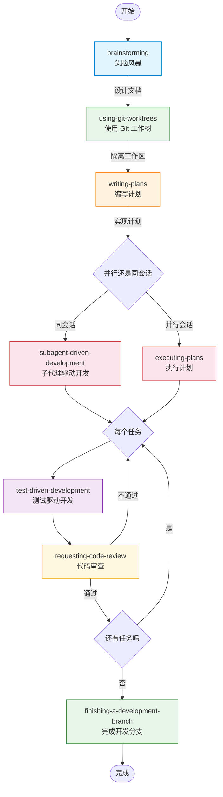

# Superpowers

Superpowers 是一套完整的软件开发方法论，适用于你的编码代理。它建立在一些可组合的技能（skills）和一套初始指令之上，确保你的代理能够运用这些技能。

## 快速开始

为你的代理赋予 Superpowers：[Claude Code](#claude-code)、[Codex CLI](#codex-cli)、[Codex App](#codex-app)、[Factory Droid](#factory-droid)、[Gemini CLI](#gemini-cli)、[OpenCode](#opencode)、[Cursor](#cursor)、[GitHub Copilot CLI](#github-copilot-cli)。

## 工作原理

这一切从你启动编码代理的那一刻开始。当它发现你正在构建某个东西时，它*不会*直接跳进写代码的步骤。相反，它会退一步，先问你到底想做什么。

一旦它从对话中梳理出需求规格，它会以足够短小、你确实能读完和消化的片段展示给你。

在你确认了设计方案后，你的代理会制定一个实现计划。这个计划足够清晰，连一个热情但品味差、没有判断力、缺乏项目上下文、又讨厌测试的初级工程师都能照着执行。它强调的是真正的红/绿 TDD、YAGNI（你不需要它）和 DRY（不要重复自己）。

接下来，一旦你说"开始"，它会启动一个*子代理驱动开发*流程，让代理逐个处理每个工程任务，检查和审查它们的工作，然后继续推进。Claude 能够自主工作数小时而不偏离你们共同制定的计划，这并不罕见。

还有很多其他内容，但以上是系统的核心。而且由于这些技能会自动触发，你不需要做任何特殊操作。你的编码代理自带 Superpowers。

## 赞助

如果 Superpowers 帮你做了赚钱的事情，并且你愿意的话，我非常感激你能考虑[赞助我的开源工作](https://github.com/sponsors/obra)。

谢谢！

- Jesse

## 安装

不同运行环境（harness）的安装方式不同。如果你使用多个环境，请为每个环境分别安装 Superpowers。

### Claude Code

Superpowers 可通过[官方 Claude 插件市场](https://claude.com/plugins/superpowers)获取。

#### 官方市场

- 从 Anthropic 的官方市场安装插件：

  ```bash
  /plugin install superpowers@claude-plugins-official
  ```

#### Superpowers 市场

Superpowers 市场提供 Superpowers 以及一些其他相关插件。

- 注册市场：

  ```bash
  /plugin marketplace add obra/superpowers-marketplace
  ```

- 从该市场安装插件：

  ```bash
  /plugin install superpowers@superpowers-marketplace
  ```

### Codex CLI

Superpowers 可通过[官方 Codex 插件市场](https://github.com/openai/plugins)获取。

- 打开插件搜索界面：

  ```bash
  /plugins
  ```

- 搜索 Superpowers：

  ```bash
  superpowers
  ```

- 选择 `Install Plugin`。

### Codex App

Superpowers 可通过[官方 Codex 插件市场](https://github.com/openai/plugins)获取。

- 在 Codex 应用中，点击侧边栏的 Plugins。
- 你应该会在 Coding 板块中看到 `Superpowers`。
- 点击 Superpowers 旁边的 `+`，然后按提示操作。

### Factory Droid

- 注册市场：

  ```bash
  droid plugin marketplace add https://github.com/obra/superpowers
  ```

- 安装插件：

  ```bash
  droid plugin install superpowers@superpowers
  ```

### Gemini CLI

- 安装扩展：

  ```bash
  gemini extensions install https://github.com/obra/superpowers
  ```

- 后续更新：

  ```bash
  gemini extensions update superpowers
  ```

### OpenCode

OpenCode 使用自己的插件安装机制；即使你已经在其他环境中使用了 Superpowers，也需要单独安装。

- 告诉 OpenCode：

  ```
  Fetch and follow instructions from https://raw.githubusercontent.com/obra/superpowers/refs/heads/main/.opencode/INSTALL.md
  ```

- 详细文档：[docs/README.opencode.md](docs/README.opencode.md)

### Cursor

- 在 Cursor Agent 聊天中，从市场安装：

  ```text
  /add-plugin superpowers
  ```

- 或者在插件市场中搜索 "superpowers"。

### GitHub Copilot CLI

- 注册市场：

  ```bash
  copilot plugin marketplace add obra/superpowers-marketplace
  ```

- 安装插件：

  ```bash
  copilot plugin install superpowers@superpowers-marketplace
  ```

## 基本工作流



1. **brainstorming（头脑风暴）** - 在写代码之前激活。通过提问来打磨粗略的想法，探索替代方案，将设计分成多个可读的片段呈现给用户验证。保存设计文档。

2. **using-git-worktrees（使用 Git 工作树）** - 在设计批准后激活。在新分支上创建隔离的工作区，运行项目初始化，验证干净的测试基线。

3. **writing-plans（编写计划）** - 在有批准的设计时激活。将工作分解为一口大小的任务（每个 2-5 分钟）。每个任务都有精确的文件路径、完整代码和验证步骤。

4. **subagent-driven-development（子代理驱动开发）或 executing-plans（执行计划）** - 在有计划时激活。为每个任务派发全新子代理，进行两阶段审查（规范符合性，然后代码质量），或者批量执行并设置人工检查点。

5. **test-driven-development（测试驱动开发）** - 在实现过程中激活。强制执行 RED-GREEN-REFACTOR：编写失败测试，观察它失败，编写最少代码，观察它通过，提交代码。先于测试编写的代码会被删除。

6. **requesting-code-review（请求代码审查）** - 在任务之间激活。对照计划进行审查，按严重程度报告问题。严重问题会阻止进度。

7. **finishing-a-development-branch（完成开发分支）** - 在任务完成时激活。验证测试，提供选项（合并/PR/保留/丢弃），清理工作树。

**代理在任何任务之前都会检查相关技能。** 这是强制性的工作流，不是建议。

## 内部构成

### 技能库

**测试**
- **test-driven-development** - RED-GREEN-REFACTOR 循环（包含测试反模式参考）

**调试**
- **systematic-debugging** - 4 阶段根因分析流程（包含根因追踪、纵深防御、条件等待等技术）
- **verification-before-completion** - 确保修复真的有效

**协作**
- **brainstorming** - 苏格拉底式设计打磨
- **writing-plans** - 详细的实现计划
- **executing-plans** - 批量执行带检查点
- **dispatching-parallel-agents** - 并发子代理工作流
- **requesting-code-review** - 代码审查前检查清单
- **receiving-code-review** - 如何回应反馈
- **using-git-worktrees** - 并行开发分支
- **finishing-a-development-branch** - 合并/PR 决策工作流
- **subagent-driven-development** - 快速迭代，两阶段审查（先规范符合性，再代码质量）

**元技能**
- **writing-skills** - 按照最佳实践创建新技能（包含测试方法）
- **using-superpowers** - 技能系统入门介绍

## 理念

- **测试驱动开发** - 始终先写测试
- **系统化而非随意** - 流程优于猜测
- **降低复杂性** - 以简洁为首要目标
- **证据优于断言** - 在宣告成功前先验证

阅读[原始发布公告](https://blog.fsck.com/2025/10/09/superpowers/)。

## 贡献

Superpowers 的一般贡献流程如下。请注意，我们通常不接受新技能的贡献，而且对技能的任何更新都必须在我们支持的所有编码代理上生效。

1. Fork 仓库
2. 切换到 `dev` 分支
3. 为你的工作创建一个分支
4. 遵循 `writing-skills` 技能来创建和测试新的或修改过的技能
5. 提交 PR，确保填好 PR 模板

完整指南请参见 `skills/writing-skills/SKILL.md`。

## 更新

Superpowers 的更新方式因编码代理而异，但通常是自动的。

## 许可证

MIT 许可证 — 详见 LICENSE 文件

## 社区

Superpowers 由 [Jesse Vincent](https://blog.fsck.com) 和 [Prime Radiant](https://primeradiant.com) 的伙伴们共同构建。

- **Discord**：[加入我们](https://discord.gg/35wsABTejz)，获取社区支持、提问，并分享你用 Superpowers 构建的东西
- **Issues**：https://github.com/obra/superpowers/issues
- **发布通知**：[注册](https://primeradiant.com/superpowers/)以获取新版本通知
