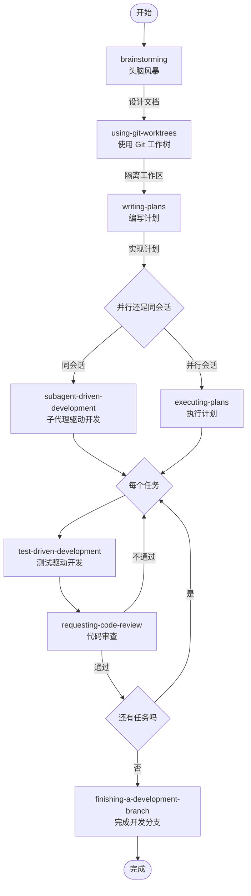

# Superpowers：给 AI 编码代理补上一套工程工作流

现在很多人用 AI 写代码，卡住的地方往往不是“模型不够聪明”，而是“模型没有稳定的方法”。它可以很快写出一段代码，但也很容易跳过设计、跳过计划、跳过验证，最后把一次本来不复杂的开发任务做成一连串返工。

[Superpowers](https://github.com/obra/superpowers) 这个项目解决的，就是这个问题。

它不是一个普通的软件仓库，也不是一组提示词模板，而是一套给编码代理使用的 workflow skills。你可以把它理解成一组“工程行为约束”：在开始实现之前先做设计澄清，设计确认后先写实施计划，遇到问题先查根因，准备结束时先做验证。它试图让代理不只是“会生成代码”，而是“按更像工程团队的方式工作”。

第一次看这个仓库时，很容易被目录和平台接入方式分散注意力。但真正的核心其实很集中：最值得看的，是 [`skills/`](https://github.com/obra/superpowers/tree/main/skills) 下面那些 `SKILL.md` 文件；其他目录，大多是在解决“怎么把这套工作流接到不同平台里”。

下面就从三个角度展开：它到底是什么，和常见的 prompt 仓库有什么不同；如果你想自己用，应该怎么接入、怎么开始；如果你打算长期使用，又该怎么把它用顺。



**快速概览**

| 维度 | 数据 |
|------|------|
| 技能数量 | 14 个可组合的 SKILL.md |
| 支持平台 | 8 种编码代理（Claude Code / Codex CLI / Codex App / Cursor / OpenCode / Gemini CLI / GitHub Copilot CLI / Factory Droid） |
| 外部依赖 | 零 |
| 当前版本 | v5.1.0 |
| 核心主张 | 先设计、再计划、TDD、验证后完成 |

## 谁会对它有兴趣

- 已经在用 Codex、Claude Code、Cursor、OpenCode 这类工具，但觉得代理表现忽好忽坏的人
- 想弄清楚 workflow skill、平台插件和仓库文档之间是什么关系的人
- 准备把 AI 编程助手真正接进开发流程，而不只是偶尔拿来补几段代码的人

## 一、仓库是什么

`superpowers` 不是一个传统意义上的应用仓库。它的核心产物不是后端服务、前端页面或 SDK，而是一组可被编码代理自动发现、自动调用、自动遵守的 workflow skills。

它要解决的核心问题不是“让代理多会几个命令”，而是“让代理形成一套更稳定的软件开发行为”。

换句话说，这个仓库关注的是代理怎么工作，而不只是代理说什么。

### 仓库的核心目标

Superpowers 试图把一名优秀工程师在真实项目中的开发习惯，拆成可复用、可组合、可触发的技能文档，例如：

- 写代码前先澄清设计
- 设计确认后先写实施计划
- 实施时优先遵守 TDD
- 遇到 bug 时先找根因，不盲修
- 宣称完成前必须重新验证

这些规则最终沉淀在 [`skills/<skill-name>/SKILL.md`](https://github.com/obra/superpowers/tree/main/skills) 中，由不同平台上的 agent 读取并执行。

### 仓库目录地图

#### `skills/`

这是整个仓库最重要的目录。每个子目录就是一个 skill，至少包含一个 `SKILL.md`。你可以直接从这里开始读：

- [`using-superpowers`](https://github.com/obra/superpowers/blob/main/skills/using-superpowers/SKILL.md)：总入口，要求 agent 先判断该不该用 skill
- [`brainstorming`](https://github.com/obra/superpowers/blob/main/skills/brainstorming/SKILL.md)：设计澄清和 spec 产出
- [`writing-plans`](https://github.com/obra/superpowers/blob/main/skills/writing-plans/SKILL.md)：把设计转成可执行计划
- [`subagent-driven-development`](https://github.com/obra/superpowers/blob/main/skills/subagent-driven-development/SKILL.md)：按任务派子代理执行
- [`executing-plans`](https://github.com/obra/superpowers/blob/main/skills/executing-plans/SKILL.md)：在无子代理或独立会话中执行计划
- [`test-driven-development`](https://github.com/obra/superpowers/blob/main/skills/test-driven-development/SKILL.md)：强制 RED-GREEN-REFACTOR
- [`systematic-debugging`](https://github.com/obra/superpowers/blob/main/skills/systematic-debugging/SKILL.md)：系统化排查根因
- [`verification-before-completion`](https://github.com/obra/superpowers/blob/main/skills/verification-before-completion/SKILL.md)：完成前必须验证
- [`requesting-code-review`](https://github.com/obra/superpowers/blob/main/skills/requesting-code-review/SKILL.md) / [`receiving-code-review`](https://github.com/obra/superpowers/blob/main/skills/receiving-code-review/SKILL.md)：代码审查前后流程
- [`using-git-worktrees`](https://github.com/obra/superpowers/blob/main/skills/using-git-worktrees/SKILL.md) / [`finishing-a-development-branch`](https://github.com/obra/superpowers/blob/main/skills/finishing-a-development-branch/SKILL.md)：隔离开发与收尾流程
- [`writing-skills`](https://github.com/obra/superpowers/blob/main/skills/writing-skills/SKILL.md)：如何继续为这套体系编写新 skill

### 这不是“提示词合集”

很多人第一次看到这种仓库，会把它理解成 prompt 模板库。Superpowers 和普通提示词集合的区别在于：

- 它强调流程顺序，而不只是回答质量
- 它强调验证与纪律，而不只是生成速度
- 它强调工作流组合，而不是单个万能 prompt
- 它把“如何工作”作为和“做什么”同样重要的设计对象

所以阅读它时，最应该关注的不是某一句 prompt 写得多漂亮，而是各个 skill 怎么串起来形成闭环。

## 二、如果你想自己用，应该从哪里开始

### 选择平台

当前仓库已经为多种代理环境准备了接入方式，支持以下平台：

- Claude Code
- Cursor
- Codex CLI / Codex App
- OpenCode
- Gemini CLI
- GitHub Copilot CLI
- Factory Droid

不同平台安装方式不同，但核心目标一致：让平台能发现 `skills/` 目录中的 `SKILL.md`，并在对话过程中按需调用。

### 安装方式

#### Codex

最直接的方式是让 Codex 自己去读取安装说明：

```text
Fetch and follow instructions from https://raw.githubusercontent.com/obra/superpowers/refs/heads/main/.codex/INSTALL.md
```

如果你想手动安装，可以参考 [Superpowers for Codex](https://github.com/obra/superpowers/blob/main/docs/README.codex.md)，核心步骤是：

1. 克隆仓库到本地。
2. 把仓库里的 `skills/` 通过符号链接暴露到 `~/.agents/skills/`。
3. 重启 Codex，让它重新扫描 skill。
4. 如果要使用多代理流程，开启 multi-agent 特性。

#### OpenCode

OpenCode 通过插件注册 skill。参考 [Superpowers for OpenCode](https://github.com/obra/superpowers/blob/main/docs/README.opencode.md)，最短配置是：

```json
{
  "plugin": ["superpowers@git+https://github.com/obra/superpowers.git"]
}
```

重启 OpenCode 后，插件会自动安装并注册 skill。

#### Claude Code / Cursor / Gemini CLI

这些平台的安装方式已经在仓库根 [README.md](https://github.com/obra/superpowers/blob/main/README.md) 中整理好了，可以直接按对应平台跳转使用。

### 怎么确认它真的生效了

安装成功后，不要先试复杂任务，先试一个很容易触发 workflow skill 的请求，例如：

- “帮我规划这个功能”
- “我们先设计一下这个改动”
- “帮我系统化排查这个 bug”
- “我有一个实施计划，帮我按计划执行”

如果平台接入正常，你通常会看到 agent 出现几个明显变化：

- 优先检查相关 skill
- 不会立刻跳进实现
- 根据任务类型进入设计、计划、调试或验证流程

如果 agent 还是像普通聊天模型一样直接动手，通常说明 skill 没被正确发现，或者 bootstrap 指令没有正确注入。

### 和它对话时，最好带上“阶段感”

Superpowers 最适合的使用方式，不是你丢一句“帮我做完”，然后等它自己神奇地进入最佳流程。更有效的做法，是把你现在所处的阶段说清楚。

#### 场景一：你有一个新需求

可以这样开场：

```text
我想做一个新功能，先帮我梳理需求和设计方案。
```

如果触发正常，你会看到它：

- 先触发 `brainstorming`
- 一次问一个关键问题
- 输出设计方案并等待你确认
- 设计确定后再进入 `writing-plans`

#### 场景二：你已经有设计，准备落地

可以这样说：

```text
设计已经确定了，帮我写实施计划。
```

如果流程顺畅，它通常会：

- 触发 `writing-plans`
- 先明确会改哪些文件
- 把任务拆成小步
- 每步都包含验证方式

#### 场景三：你已经有计划，准备执行

可以这样说：

```text
按这个 plan 开始执行。
```

比较理想的情况是：

- 在支持多代理的平台优先使用 `subagent-driven-development`
- 在不适合多代理的场景使用 `executing-plans`
- 每完成一段工作就做 review 和验证

#### 场景四：你在修 bug

可以这样说：

```text
这个问题不要盲修，先帮我找根因。
```

如果工作流生效，它会更倾向于：

- 优先进入 `systematic-debugging`
- 先复现，再找证据，再定位根因
- 不会在没有证据的情况下乱改代码

### 一个更稳的上手顺序

如果你只想先感受它和普通 AI 编程助手的区别，可以按这个顺序试：

1. 按你的平台完成安装。
2. 新开一个会话。
3. 提一个会触发设计或调试 skill 的真实任务。
4. 观察 agent 是否遵守“先设计/先排查/先计划”的流程。
5. 再逐步尝试 plan 执行、子代理协作和代码审查流程。

## 三、真正决定体验的，不是安装，而是你怎么把 agent 带进流程

Superpowers 难的部分从来不是装上，而是你愿不愿意让代理接受约束。仓库里的核心 skill 几乎都在做同一件事：阻止 agent 过早行动。真正把它用顺，关键不是背 skill 名字，而是让每次对话都带着明确的阶段信息。

### 先告诉代理：你现在处在哪个阶段

源码里的 `using-superpowers` 只保证一件事：代理在行动前先检查 skill。它不会替你猜当前任务到底是“还在设计”“准备拆计划”“已经可以执行”，所以用户的开场方式会直接影响后续流程。

如果你要的是设计阶段，最好像这样说：

```text
我想做一个新功能，先帮我收敛需求和设计，不要开始实现。
```

如果你已经认可方案，想进入拆解阶段，可以说：

```text
设计已经定了，下一步只写 implementation plan。
```

如果 plan 已经在手，目标就是按步骤推进：

```text
按这个 plan 执行，遇到阻塞先停下来，不要猜着做。
```

如果你在修 bug，最有效的开场不是“改一版试试”，而是：

```text
先找根因，先不要给修法。
```

如果你准备收尾，也最好把预期说清楚：

```text
先做最终验证，再告诉我该合并、提 PR，还是保留分支。
```

这些说法之所以有效，不是因为“提示词写得更聪明”，而是因为它们和仓库里的 skill 触发条件是对齐的。

### 一个 spec，最好只服务一个聚焦目标

`brainstorming` 和 `writing-plans` 都有一个很强的前提：如果需求其实包含多个彼此独立的子系统，就应该先拆开，而不是试图用一个 spec 和一个 plan 把所有事情一起兜住。

所以像“顺手把支付、通知、后台管理和埋点都补上”这样的需求，放进普通聊天模型里可能只是显得大一点；放进 Superpowers 里，它更像一个应该先拆题的信号。仓库原文里对这一点写得很直白：范围过大时，先帮助用户分解成多个子项目，再让每个子项目分别走 spec → plan → implementation 的闭环。

从实操角度看，这意味着：

- 一次对话最好只推进一个主目标
- 一个 spec 最好只回答一件事情“要怎么做”
- 一个 plan 最好只对应一条能独立交付的实现路线

这样后面的子代理执行、review 和验证才不会失控。

### 把中间产物当正式交付物，而不是聊天记录

Superpowers 的一个重要区别，是它不把设计和计划当作“对话里的临时过渡”。`brainstorming` 要求把设计写进 `docs/superpowers/specs/`，`writing-plans` 要求把实施计划写进 `docs/superpowers/plans/`。这背后的含义很重要：spec 和 plan 不是辅助说明，而是工作流的正式输入。

如果你想把这套东西真正用起来，最好的习惯不是“让 agent 最后给一个总结”，而是要求它持续暴露中间产物：

- 设计是否已经成文
- plan 是否已经细到可以逐步执行
- review 是基于什么要求做的
- 完成声明对应的是哪条验证命令

这样一来，后续无论是换会话、换平台、换代理，还是人类自己接手，都会轻松很多。

### 并行很强，但前提是任务真的独立

很多人第一次看到 `subagent-driven-development` 和 `dispatching-parallel-agents`，容易把它们理解成“多开几个 agent 更快”。源码其实没有这么乐观。两个 skill 都在强调一件事：并行的前提是任务之间依赖低、边界清晰、共享状态少。

`subagent-driven-development` 适合的是“已经有 plan，而且任务大多可以独立推进”的场景。它的重点不是纯粹并行，而是“每个任务派 fresh subagent + 每个任务后做两阶段评审”。

`dispatching-parallel-agents` 更严格，它主要针对多个互不依赖的问题域，例如：

- 不同测试文件各自失败，而且根因不同
- 多个子系统独立出问题
- 多个调查任务之间没有共享状态

如果问题本身强耦合，盲目并行只会制造冲突。Superpowers 的思路并不是“永远多开代理”，而是“只在值得并行时并行”。

### 最后一句话必须和证据绑定

如果只看理念，Superpowers 很像一套“先设计、再计划、重验证”的工程规范；如果只看约束强度，最硬的一条其实来自 `verification-before-completion`：没有新鲜验证证据，就不能宣称事情已经完成。

这也是你在日常使用里最值得主动坚持的一条规则。结束前至少要让 agent 明确两件事：

1. 它刚刚运行了什么命令。
2. 这些输出具体证明了什么结论。

只要你把这一步坚持住，很多“明明没测却说 done”的假完成问题，都会明显减少。

## 四、它的核心 skill，分别在做什么

如果只按目录看，14 个 skill 很容易显得零散。更好的读法是：把每个 skill 看成一个“触发条件 + 强制约束 + 用户配合方式”的组合。下面按这个顺序来读，会更接近它们在源码里的真实作用。

### 入口与调度

#### `using-superpowers`

- 什么时候触发：新对话开始，或者进入一个新任务时。
- 它强制什么：代理在任何响应或行动前，都要先判断有没有适用 skill；哪怕只有 1% 的可能性，也要先检查。另一个关键规则是“用户指令 > skill > 默认系统提示”。
- 你怎么配合：把任务类型说清楚，例如“先设计”“先写 plan”“先排查根因”，不要只说“帮我搞定这个”。

#### `dispatching-parallel-agents`

- 什么时候触发：面对 2 个以上可以独立处理的问题域时，尤其是多个失败测试、多个独立子系统调查任务同时出现时。
- 它强制什么：一个独立问题域只派一个 agent；每个 agent 的提示都必须聚焦、带约束、带预期输出；集成前要再跑完整验证。
- 你怎么配合：按“问题域”拆任务，而不是按“我想开几个 agent”拆任务。只要多个问题会共享状态或互相影响，就不该用它。

### 主流程

#### `brainstorming`

- 什么时候触发：任何创造性工作之前，包括新功能、组件新增、行为修改。
- 它强制什么：先探索项目上下文，再一次只问一个问题；给出 2 到 3 个方案和取舍；分段呈现设计；设计获批前不允许进入实现；设计确认后还要写成 spec 文档。
- 你怎么配合：回答目标、约束和成功标准；如果需求过大，接受先拆题；不要在设计还没被确认时催它“顺手把代码也写了”。

#### `writing-plans`

- 什么时候触发：spec 已经批准，且接下来是一个多步骤实现任务。
- 它强制什么：先规划文件结构和职责边界，再把任务拆成 2 到 5 分钟粒度的小步；每步都写清楚文件路径、代码或操作、验证方式；默认按 DRY、YAGNI、TDD 来组织。
- 你怎么配合：把它当成给“低上下文执行者”的说明书来审阅，重点看步骤是否足够小、职责是否清楚、验证是否真的可执行，而不是只看文风。

#### `using-git-worktrees`

- 什么时候触发：正式开始功能开发，或在执行 implementation plan 之前。
- 它强制什么：不是随手切个分支就开始，而是先决定 worktree 放哪；如果是项目内目录，还要验证它被 `.gitignore` 正确忽略；然后跑依赖安装和基线测试，确认新环境是干净的。
- 你怎么配合：如果仓库里还没有固定 worktree 位置，明确给出约定；如果基线测试本来就失败，要决定先修环境还是接受带着已知问题继续。

#### `subagent-driven-development`

- 什么时候触发：已经有 implementation plan，任务之间大多独立，而且当前平台支持子代理。
- 它强制什么：每个任务派一个 fresh subagent；主代理负责协调，不把整段会话历史全部喂给子任务；每个任务完成后，先做 spec compliance review，再做 code quality review。
- 你怎么配合：给它一份足够清楚的 plan，并接受它在任务之间插入澄清、复核和返工，而不是期待“一次性并行跑完所有事情”。

#### `executing-plans`

- 什么时候触发：已经有书面 plan，但当前环境不适合用子代理，或者你明确希望顺序执行。
- 它强制什么：实现前先完整读 plan 并做批判性审查；之后严格按步骤执行；一旦遇到阻塞、计划缺口或验证失败，就停下来，不允许硬猜。
- 你怎么配合：如果 plan 有问题，先改 plan；不要一边要求它“按计划来”，一边又期待它在关键分叉处自行发明新方案。

#### `finishing-a-development-branch`

- 什么时候触发：实现已经完成、测试已通过，接下来要决定如何集成工作。
- 它强制什么：先验证测试，再识别 base branch，然后只给出四个收尾选项：本地合并、推送并建 PR、保留分支、放弃工作。它甚至要求丢弃分支前必须有明确确认。
- 你怎么配合：把收尾选择当成显式决策来做，而不是扔一句“那你看着办吧”。如果要丢弃工作，就明确确认。

### 质量保障与工程纪律

#### `test-driven-development`

- 什么时候触发：任何新功能、bugfix、重构或行为变更。
- 它强制什么：先写测试、先看测试失败，再写最小实现，然后进入 RED-GREEN-REFACTOR。源码里最激进的一条是：如果你先写了生产代码，那段代码应该删掉，重新从测试开始。
- 你怎么配合：不要把“这次先别那么严格”当默认例外；如果真的是一次性原型、生成代码或配置改动，明确说明为什么不适合套 TDD。

#### `systematic-debugging`

- 什么时候触发：任何 bug、测试失败、异常行为、性能问题、构建失败、集成问题。
- 它强制什么：四阶段处理技术问题，第一阶段永远是根因调查；先读错误、先复现、先看最近改动、先补证据，再提假设和最小修复。连续几次修不对时，还要求回头质疑架构，而不是一直补丁叠补丁。
- 你怎么配合：优先给复现步骤、日志、报错和最近改动，不要把“先试试这样改”当成默认 debug 方式。

#### `verification-before-completion`

- 什么时候触发：任何“完成了”“修好了”“通过了”之类的正向状态声明之前，以及提交、开 PR、切换任务之前。
- 它强制什么：先识别验证命令，再执行，再读完整输出，再判断能不能得出结论。没有新鲜证据，就不能说成功。
- 你怎么配合：要求 agent 把“验证命令”和“基于输出得出的结论”一起给出来，而不是只听一个口头总结。

#### `requesting-code-review`

- 什么时候触发：子代理执行流程里的每个任务之后、主要功能完成后、合并前。
- 它强制什么：review 不是一句“帮我看看”，而是要带着清晰上下文发起，包括实现了什么、依据什么要求、base/head SHA 分别是什么。
- 你怎么配合：让 review 对着 plan 或 requirement 来看，而不是做一场没有参照物的泛泛点评。

#### `receiving-code-review`

- 什么时候触发：收到 review 反馈之后，尤其是反馈不清晰、技术上存疑，或者和现有代码库现实不一致时。
- 它强制什么：先完整读懂，再用自己的话复述，再对照代码库验证，再决定采纳还是 push back。这个 skill 很强硬，甚至连“表演式赞同”都不鼓励，目标就是避免还没验证就先口头认同。
- 你怎么配合：如果反馈里有几项没看明白，先澄清再改；如果 agent 基于技术理由反驳 review，不要把这理解成顶嘴，它其实是在执行源码要求的“先验证，再实施”。

### 维护与扩展

#### `writing-skills`

- 什么时候触发：你想新增 skill、修改现有 skill，或者在部署前验证一个 skill 是否真的有用。
- 它强制什么：把写 skill 本身也当成一种 TDD；先构造失败场景，看没有 skill 时 agent 会怎么出错，再写 `SKILL.md` 去修正这种行为；同时还要为 skill 的触发描述做“可发现性”设计。
- 你怎么配合：别把它当经验随笔生成器。一个好的 skill 不是“我上次怎么做的故事”，而是“下次 agent 在什么条件下应该自动采用什么方法”。

## 五、把这些 skill 串起来，才是它真正的价值

如果按源码推荐的路径走，一次相对标准的任务大致会长这样：

1. 你提出一个需求，`using-superpowers` 先决定当前该检查哪些 skill。
2. 如果这是新功能或行为变更，就先进入 `brainstorming`，把模糊想法收敛成设计，并写成 spec。
3. 设计批准后，`writing-plans` 把 spec 变成细颗粒度 plan，明确文件、步骤和验证。
4. 真正开始改之前，`using-git-worktrees` 先准备隔离工作区并确认基线干净。
5. 开始实施时，如果平台支持子代理，优先走 `subagent-driven-development`；否则走 `executing-plans`。
6. 实施过程中，`test-driven-development`、`systematic-debugging`、`requesting-code-review`、`receiving-code-review` 会在不同节点持续约束 agent 的行为。
7. 准备结束前，`verification-before-completion` 先卡住“假完成”。
8. 最后由 `finishing-a-development-branch` 把收尾动作变成显式选择，而不是含糊地“看着处理”。

这条主线为什么重要？因为它把一个常见但难以稳定复现的能力，拆成了一系列可被检查的阶段。普通 AI 编程往往强在“局部生成”，弱在“流程连续性”；Superpowers 的价值恰好相反，它在尽量把流程连续性做成默认行为。

## 六、如果只想先抓重点，先看这几个 skill

如果你第一次读这个仓库，最值得先看的是下面五个：

1. `using-superpowers`
2. `brainstorming`
3. `writing-plans`
4. `test-driven-development`
5. `verification-before-completion`

这五个 skill 基本定义了整套系统的行为基线：先判断流程、先做设计、再写计划、实现遵守 TDD、结束前必须验证。

如果你想更快建立“看到什么请求，就该想到哪个 skill”的感觉，下面这张表会比目录更好用：

| Skill | 看到什么请求时优先想到它 |
|---|---|
| `using-superpowers` | 任何新对话、新任务开始 |
| `brainstorming` | 新功能、改行为、做设计取舍 |
| `writing-plans` | 设计已定，准备拆实现步骤 |
| `using-git-worktrees` | 正式开始改代码前，需要隔离环境 |
| `subagent-driven-development` | plan 已有，任务独立，平台支持 subagent |
| `executing-plans` | plan 已有，但要顺序执行或没有 subagent |
| `dispatching-parallel-agents` | 多个问题域独立，值得并行调查 |
| `test-driven-development` | 要写新行为，或修 bug、做重构 |
| `systematic-debugging` | 测试失败、线上 bug、构建异常、性能问题 |
| `verification-before-completion` | 准备说“完成了”之前 |
| `requesting-code-review` | 任务收尾、主要功能完成、合并前 |
| `receiving-code-review` | 收到 review，准备决定是否采纳 |
| `finishing-a-development-branch` | 测试通过，准备合并、PR 或清理 |
| `writing-skills` | 想为这套体系新增或改造 skill |

## 七、几个很常见的误区

### 把它当成“高级 prompt”

如果只是偶尔手动说一句“use brainstorming”，你只用到了这套系统很小的一部分。Superpowers 的重点不是单个命令，而是阶段之间的衔接。

### 一上来就让 agent 直接写代码

这会绕开仓库最有价值的部分。真正让产出质量稳定的，通常不是实现能力本身，而是前置设计、计划粒度、验证纪律和收尾流程。

### 只看一个 skill，不看全流程

单独看 `test-driven-development` 或 `systematic-debugging` 都很有用，但 Superpowers 的强项在于多个 skill 串起来形成闭环。

## 八、如果你打算继续往下读

读完这篇之后，最值得继续看的通常是这几处：

1. 看仓库根 [README.md](https://github.com/obra/superpowers/blob/main/README.md)，确认你的平台安装路径。
2. 看 [docs/skills-overview.md](https://github.com/obra/superpowers/blob/main/docs/skills-overview.md)，建立对整套 skill 的整体认识。
3. 直接阅读 [`skills/`](https://github.com/obra/superpowers/tree/main/skills) 下你最常用的几个 `SKILL.md`。
4. 找一个真实任务，在会话里实际跑一遍“设计 → 计划 → 执行 → 验证”的完整闭环。
