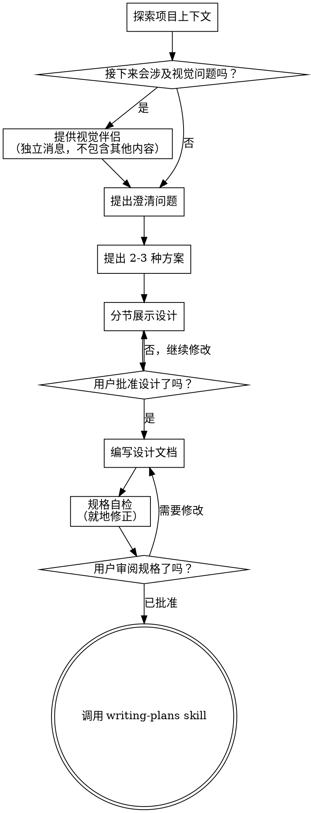

# 将想法梳理成设计

帮助通过自然的协作式对话，把想法转化为完整的设计和规格。

先理解当前项目上下文，然后一次问一个问题来细化想法。等你明确知道要构建什么之后，提出设计并获得用户批准。

<HARD-GATE>
在你展示设计并获得用户批准之前，不要调用任何实现类技能、编写任何代码、搭建任何项目，也不要采取任何实现动作。无论任务看起来多么简单，这条规则都适用于所有项目。
</HARD-GATE>

## 反模式："这太简单了，不需要设计"

每个项目都要经过这个过程。待办列表、单函数工具、配置修改，都是如此。"简单"项目最容易因为未经审视的假设而浪费最多工作。设计可以很短（对于真正简单的项目，只需几句话），但你必须先展示它并获得批准。

## 检查清单

你必须为下面每一项创建一个任务，并按顺序完成：

1. **探索项目上下文** — 检查文件、文档、最近提交
2. **提供视觉伴侣**（如果主题会涉及视觉问题）— 这是一条独立消息，不能和澄清问题合并。见下方“视觉伴侣”部分。
3. **提出澄清问题** — 一次一个，弄清目标、约束和成功标准
4. **提出 2-3 种方案** — 说明权衡并给出推荐
5. **展示设计** — 按复杂度分节呈现，并在每一节后征求用户批准
6. **编写设计文档** — 保存到 `docs/superpowers/specs/YYYY-MM-DD-<topic>-design.md` 并提交
7. **规格自检** — 快速行内检查占位符、矛盾、歧义和范围问题（见下）
8. **让用户审阅书面规格** — 在继续前，请用户先查看规格文件
9. **切换到实现** — 调用 `writing-plans` skill 来创建实现计划

## 流程图



**终止状态是调用 `writing-plans`。** 不要调用 `frontend-design`、`mcp-builder` 或任何其他实现类 skill。完成 brainstorming 之后，唯一可以调用的下一个 skill 就是 `writing-plans`。

## 流程

**理解想法：**

- 先查看当前项目状态（文件、文档、最近提交）
- 在提出详细问题之前，先评估范围：如果需求描述了多个彼此独立的子系统（例如“做一个包含聊天、文件存储、计费和分析的平台”），要立刻指出这一点。不要花时间去细化一个本来就需要拆分成多个子项目的需求。
- 如果项目过大，不适合写进一个规格，帮用户拆分成子项目：哪些部分彼此独立、它们如何关联、应该按什么顺序构建？然后按正常设计流程先梳理第一个子项目。每个子项目都要有自己的规格 → 计划 → 实现周期。
- 对于范围合适的项目，一次问一个问题来细化想法
- 尽量使用多选题；如果合适，也可以开放式提问
- 每条消息只问一个问题。如果主题需要更多探索，就拆成多条消息
- 重点放在理解：目的、约束、成功标准

**探索方案：**

- 提出 2-3 种不同方案，并说明权衡
- 以对话方式呈现选项，同时给出你的推荐和理由
- 先说你推荐的方案，并解释为什么

**展示设计：**

- 当你认为自己已经理解要做什么时，再展示设计
- 按复杂度分节：简单项目可以只写几句话，复杂项目可以到 200-300 字
- 每一节后都要问用户是否目前看起来正确
- 覆盖：架构、组件、数据流、错误处理、测试
- 如果用户不理解，随时准备回去继续澄清

**为隔离和清晰而设计：**

- 把系统拆成更小的单元，每个单元都有明确用途，通过定义清楚的接口通信，并且可以独立理解和测试
- 对于每个单元，你都应该能回答：它做什么、怎么使用、依赖什么
- 不看内部实现，也能理解这个单元是做什么的吗？如果修改内部实现不会影响消费者吗？如果不能，边界就需要重新划分
- 更小、更清晰的单元也更利于你工作 - 你能在更小的上下文里推理，而当文件变大时，通常说明它承担了过多职责

**在已有代码库中工作：**

- 在提出修改方案前，先探索现有结构，并遵循已有模式
- 如果现有代码中有会影响这项工作的问题（例如某个文件过大、边界不清、职责缠绕），把有针对性的改进也纳入设计。好的开发者会顺手改进自己正在处理的地方。
- 不要提出无关重构。保持聚焦，只做对当前目标有帮助的改动

## 在设计之后

**文档：**

- 将已验证的设计（spec）写入 `docs/superpowers/specs/YYYY-MM-DD-<topic>-design.md`
  - （如果用户对 spec 位置有偏好，以用户偏好为准）
- 如可用，使用 `elements-of-style:writing-clearly-and-concisely` skill
- 将设计文档提交到 git

**规格自检：**
写完 spec 文档后，用新的视角重新检查：

1. **占位符检查：** 是否还有 "TBD"、"TODO"、未完成的章节，或者模糊的要求？如有，直接修正。
2. **内部一致性：** 各部分是否互相矛盾？架构是否与功能描述一致？
3. **范围检查：** 这个内容是否足够聚焦，能写成一个实现计划，还是需要拆分？
4. **歧义检查：** 有没有哪条要求可能被理解成两种不同意思？如果有，选定一个并写清楚。

就地修正发现的问题。无需重新完整审查，只要修好继续往下走。

**用户审阅门槛：**
规格审查循环通过后，要求用户在继续前审阅已写好的规格：

> "Spec written and committed to `<path>`. Please review it and let me know if you want to make any changes before we start writing out the implementation plan."

等待用户回复。如果他们要求修改，就修正并重新执行规格审查循环。只有在用户批准后，才继续下一步。

**实现：**

- 调用 `writing-plans` skill 来创建详细的实现计划
- 不要调用任何其他 skill。`writing-plans` 是下一步唯一允许调用的 skill。

## 核心原则

- **一次一个问题** - 不要把用户淹没在一堆问题里
- **优先多选题** - 比开放式问题更容易回答
- **坚决遵守 YAGNI** - 从所有设计里删掉不必要的功能
- **探索替代方案** - 在定稿前始终提出 2-3 个方案
- **增量验证** - 先展示设计，获得批准后再继续
- **保持灵活** - 如果不合理，就回去继续澄清

## 视觉伴侣

一个基于浏览器的视觉脑暴伴侣，用来展示 mockup、图表和选项。

**何时使用**

按每个问题分别决定，而不是按整个会话决定。判断标准是：**用户看到它会不会比读文字更容易理解？**

**使用浏览器** 的情况，是当内容本身就是视觉内容时：

- **UI mockup** — 线框图、布局、导航结构、组件设计
- **架构图** — 系统组件、数据流、关系图
- **并排视觉对比** — 对比两个布局、两套配色、两种设计方向
- **设计打磨** — 当问题涉及观感、间距、视觉层级时
- **空间关系** — 状态机、流程图、实体关系图，以图表形式呈现时

**使用终端** 的情况，是当内容是文本或表格时：

- **需求和范围问题** — “X 是什么意思？”，“哪些功能在范围内？”
- **概念性 A/B/C 选择** — 在文字描述的方案之间做选择
- **权衡列表** — 优缺点、对比表
- **技术决策** — API 设计、数据建模、架构方案选择
- **澄清问题** — 任何答案本质上是文字而不是视觉偏好

一个“关于 UI 的问题”并不自动意味着它是视觉问题。“你想要什么样的向导？”是概念问题 - 用终端；“这些向导布局里哪一个感觉对？”是视觉问题 - 用浏览器。

**工作方式**

服务器会监视一个目录里的 HTML 文件，并把最新的那个显示给浏览器。你把 HTML 内容写到 `screen_dir`，用户就会在浏览器里看到，并且可以点击来选择选项。选择结果会记录到 `state_dir/events`，你在下一轮读取即可。

**内容片段 vs 完整文档：** 如果你的 HTML 文件以 `<!DOCTYPE` 或 `<html` 开头，服务器会原样提供它（只是注入辅助脚本）。否则，服务器会自动用 frame template 包裹你的内容 - 添加标题、CSS 主题、选择指示器和所有交互基础设施。**默认写内容片段。** 只有在你需要完全控制页面时，才写完整文档。

## 启动会话

```bash
# 启动带持久化的服务器（mockup 会保存到项目里）
scripts/start-server.sh --project-dir /path/to/project

# 返回：{"type":"server-started","port":52341,"url":"http://localhost:52341",
#           "screen_dir":"/path/to/project/.superpowers/brainstorm/12345-1706000000/content",
#           "state_dir":"/path/to/project/.superpowers/brainstorm/12345-1706000000/state"}
```

保存返回结果里的 `screen_dir` 和 `state_dir`。告诉用户打开 URL。

**查找连接信息：** 服务器会把启动 JSON 写到 `$STATE_DIR/server-info`。如果你把服务器放到后台后没有捕获 stdout，就读这个文件来拿 URL 和端口。使用 `--project-dir` 时，请检查 `<project>/.superpowers/brainstorm/` 里的会话目录。

**注意：** 传入项目根目录作为 `--project-dir`，这样 mockup 会保存在 `.superpowers/brainstorm/` 中，并且在服务器重启后仍然存在。如果不传，文件会放到 `/tmp`，并在之后被清理。如果项目里还没有 `.gitignore`，请提醒用户把 `.superpowers/` 加进去。

**按平台启动服务器：**

**Claude Code（macOS / Linux）：**
```bash
# 默认模式即可 - 脚本会自己把服务器放到后台
scripts/start-server.sh --project-dir /path/to/project
```

**Claude Code（Windows）：**
```bash
# Windows 会自动检测并使用前台模式，这会阻塞工具调用。
# 在 Bash 工具调用里使用 run_in_background: true，这样服务器就能在会话间保持存活。
scripts/start-server.sh --project-dir /path/to/project
```
通过 Bash 工具调用时，请把 `run_in_background: true` 设上。然后在下一轮读取 `$STATE_DIR/server-info` 来拿 URL 和端口。

**Codex：**
```bash
# Codex 会回收后台进程。脚本会自动检测 CODEX_CI 并切换到前台模式。
# 正常运行即可 - 不需要额外参数。
scripts/start-server.sh --project-dir /path/to/project
```

**Gemini CLI：**
```bash
# 使用 --foreground，并在 shell 工具调用中设置 is_background: true
# 这样进程才能在多轮对话之间持续存在
scripts/start-server.sh --project-dir /path/to/project --foreground
```

**其他环境：** 服务器必须在多轮对话之间持续运行在后台。如果你的环境会回收分离出来的进程，请使用 `--foreground`，并用你的平台对应的后台执行机制来启动命令。

如果 URL 在浏览器里无法访问（远程 / 容器化环境里很常见），就绑定一个非回环主机：

```bash
scripts/start-server.sh \
  --project-dir /path/to/project \
  --host 0.0.0.0 \
  --url-host localhost
```

使用 `--url-host` 来控制返回的 URL JSON 中打印的主机名。

## 循环流程

1. **检查服务器是否还活着**，然后把新的 HTML 写到 `screen_dir` 里的一个新文件：
   - 每次写之前，先检查 `$STATE_DIR/server-info` 是否存在。如果不存在（或者 `$STATE_DIR/server-stopped` 存在），说明服务器已经停止 - 先用 `start-server.sh` 重启，再继续。
   - 服务器在 30 分钟无活动后会自动退出。
   - 使用语义化文件名：`platform.html`、`visual-style.html`、`layout.html`
   - **不要复用文件名** - 每一屏都要用新文件
   - 使用 Write 工具 - **不要用 cat / heredoc**（会把噪音灌进终端）
   - 服务器会自动提供最新文件

2. **告诉用户接下来会看到什么，然后结束本轮：**
   - 每一步都要提醒他们 URL，不只是第一次
   - 简要说明屏幕上的内容（例如：“正在展示首页的 3 种布局方案”）
   - 提醒他们在终端回复："Take a look and let me know what you think. Click to select an option if you'd like."

3. **下一轮** - 当用户在终端回复后：
   - 如果存在，读取 `$STATE_DIR/events` - 这里会以 JSON 行的形式记录用户在浏览器中的交互（点击、选择）
   - 结合用户的终端文本，得到完整反馈
   - 终端消息是主要反馈；`state_dir/events` 提供结构化交互数据

4. **迭代或推进** - 如果反馈改变了当前屏幕，就写一个新文件（例如 `layout-v2.html`）。只有当前步骤被验证后，才进入下一个问题。

5. **在回到终端时清空旧内容** - 当下一步不需要浏览器时（例如澄清问题、权衡讨论），推送一个等待屏幕以清掉旧内容：

   ```html
   <!-- filename: waiting.html (or waiting-2.html, etc.) -->
   <div style="display:flex;align-items:center;justify-content:center;min-height:60vh">
     <p class="subtitle">继续在终端中进行...</p>
   </div>
   ```

   这样可以避免用户还盯着一个已经解决的选择，而对话已经转到别处。下一次需要视觉问题时，再像平常一样推送新的内容文件。

6. 重复，直到完成。

## 编写内容片段

只写会放进页面里的内容。服务器会自动把它包进 frame template 里（标题、主题 CSS、选择指示器和所有交互基础设施）。

**最小示例：**

```html
<h2>哪种布局更合适？</h2>
<p class="subtitle">请考虑可读性和视觉层级</p>

<div class="options">
  <div class="option" data-choice="a" onclick="toggleSelect(this)">
    <div class="letter">A</div>
    <div class="content">
      <h3>单栏</h3>
      <p>干净、聚焦的阅读体验</p>
    </div>
  </div>
  <div class="option" data-choice="b" onclick="toggleSelect(this)">
    <div class="letter">B</div>
    <div class="content">
      <h3>双栏</h3>
      <p>侧边栏导航 + 主内容区</p>
    </div>
  </div>
</div>
```

就这些。不需要 `<html>`、不需要 CSS，也不需要 `<script>` 标签。服务器会提供这些。

## 可用的 CSS 类

frame template 会为你的内容提供这些 CSS 类：

### 选项（A/B/C 选择）

```html
<div class="options">
  <div class="option" data-choice="a" onclick="toggleSelect(this)">
    <div class="letter">A</div>
    <div class="content">
      <h3>标题</h3>
      <p>描述</p>
    </div>
  </div>
</div>
```

**多选：** 在容器上加 `data-multiselect`，就可以允许用户选择多个选项。每次点击会切换该项的选中状态。指示条会显示计数。

```html
<div class="options" data-multiselect>
  <!-- 这里的选项写法一样 - 用户可以多选或取消多选 -->
</div>
```

### 卡片（视觉设计）

```html
<div class="cards">
  <div class="card" data-choice="design1" onclick="toggleSelect(this)">
    <div class="card-image"><!-- mockup 内容 --></div>
    <div class="card-body">
      <h3>名称</h3>
      <p>描述</p>
    </div>
  </div>
</div>
```

### mockup 容器

```html
<div class="mockup">
  <div class="mockup-header">预览：仪表盘布局</div>
  <div class="mockup-body"><!-- 你的 mockup HTML --></div>
</div>
```

### 分栏视图（并排）

```html
<div class="split">
  <div class="mockup"><!-- 左侧 --></div>
  <div class="mockup"><!-- 右侧 --></div>
</div>
```

### 优缺点

```html
<div class="pros-cons">
  <div class="pros"><h4>优点</h4><ul><li>好处</li></ul></div>
  <div class="cons"><h4>缺点</h4><ul><li>不足</li></ul></div>
</div>
```

### mock 元素（线框图积木）

```html
<div class="mock-nav">Logo | 首页 | 关于 | 联系</div>
<div style="display: flex;">
  <div class="mock-sidebar">导航</div>
  <div class="mock-content">主内容区域</div>
</div>
<button class="mock-button">操作按钮</button>
<input class="mock-input" placeholder="输入框">
<div class="placeholder">占位区域</div>
```

### 字体和分区

- `h2` — 页面标题
- `h3` — 分区标题
- `.subtitle` — 标题下方的次级文本
- `.section` — 带底部间距的内容块
- `.label` — 小号大写标签文字

## 浏览器事件格式

当用户在浏览器里点击选项时，他们的交互会被记录到 `$STATE_DIR/events`（每行一个 JSON 对象）。当你推送新的屏幕后，这个文件会自动清空。

```jsonl
{"type":"click","choice":"a","text":"Option A - Simple Layout","timestamp":1706000101}
{"type":"click","choice":"c","text":"Option C - Complex Grid","timestamp":1706000108}
{"type":"click","choice":"b","text":"Option B - Hybrid","timestamp":1706000115}
```

完整的事件流会显示用户的探索路径 - 他们在最终确定前可能会点击多个选项。最后一个 `choice` 事件通常就是最终选择，但点击模式也能揭示犹豫或偏好，值得继续追问。

如果 `$STATE_DIR/events` 不存在，说明用户没有使用浏览器交互 - 只使用他们在终端里的文本即可。

## 设计提示

- **按问题调整保真度** — 布局问题用线框图，打磨问题就展示更精细的视觉稿
- **每一页都要解释问题** — 例如“哪个布局看起来更专业？”，不要只写“选一个”
- **先迭代，再推进** — 如果反馈改变了当前屏幕，就写一个新版本
- **每屏 2-4 个选项上限**
- **在重要时使用真实内容** — 比如摄影作品集要用真实图片（Unsplash）。占位内容会掩盖设计问题。
- **保持 mockup 简洁** — 聚焦布局和结构，不要追求像素级完美

## 文件命名

- 使用语义化名字：`platform.html`、`visual-style.html`、`layout.html`
- 不要复用文件名 — 每一屏都必须是新文件
- 迭代时：加版本后缀，例如 `layout-v2.html`、`layout-v3.html`
- 服务器按修改时间提供最新文件

## 清理

```bash
scripts/stop-server.sh $SESSION_DIR
```

如果会话使用了 `--project-dir`，mockup 文件会继续保留在 `.superpowers/brainstorm/` 中，方便之后参考。只有 `/tmp` 会话会在停止时被删除。

## 参考

- Frame template（CSS 参考）：`scripts/frame-template.html`
- Helper 脚本（客户端）：`scripts/helper.js`
