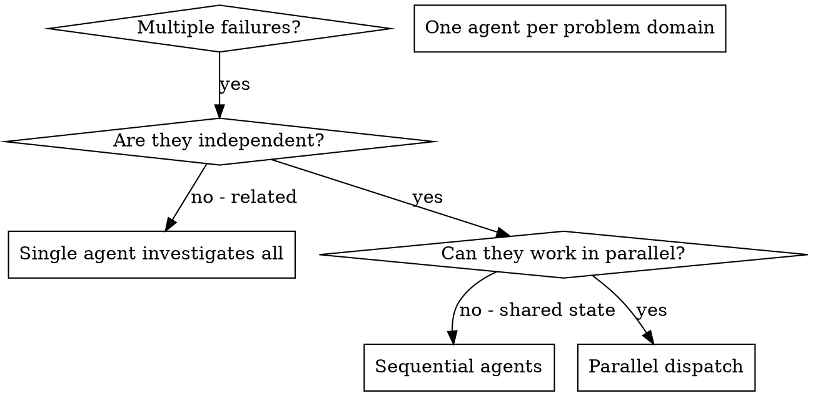

# 分派并行代理

## 概述

你通过将任务委派给上下文彼此隔离的专门代理来完成工作。只要你精确地设计它们的指令和上下文，它们就会保持聚焦并把任务做好。它们绝不应继承你当前会话的上下文或历史记录，而是只接收你为它们构造的必要信息。这样也能把你的上下文保留给协调工作。

当你面对多个彼此无关的失败时（不同的测试文件、不同的子系统、不同的 bug），按顺序逐个调查会浪费时间。每个调查都是独立的，可以并行进行。

**核心原则：** 为每个独立的问题域分派一个代理，让它们并发工作。

## 何时使用



**使用场景：**
- 3 个或更多测试文件失败，且根因不同
- 多个子系统独立损坏
- 每个问题都可以在不依赖其他问题上下文的情况下理解
- 各调查之间没有共享状态

**不要使用：**
- 这些失败彼此相关（修复一个可能会修复其他）
- 需要理解完整系统状态
- 代理之间会互相干扰

## 模式

### 1. 识别独立域

按“哪里坏了”来分组失败：
- 文件 A 的测试：工具审批流程
- 文件 B 的测试：批量完成行为
- 文件 C 的测试：中止功能

每个域都是独立的 - 修复工具审批不会影响中止测试。

### 2. 创建聚焦的代理任务

每个代理都应获得：
- **明确范围：** 一个测试文件或一个子系统
- **清晰目标：** 让这些测试通过
- **约束：** 不要修改其他代码
- **预期输出：** 发现了什么、修复了什么的摘要

### 3. 并行分派

```typescript
// 在 Claude Code / AI 环境中
Task("Fix agent-tool-abort.test.ts failures")
Task("Fix batch-completion-behavior.test.ts failures")
Task("Fix tool-approval-race-conditions.test.ts failures")
// 三个任务会并发运行
```

### 4. 审查并整合

当代理返回结果后：
- 阅读每一份摘要
- 验证各项修复不会冲突
- 运行完整测试套件
- 整合所有改动

## 代理提示结构

好的代理提示应当：
1. **聚焦** - 一个清晰的问题域
2. **自包含** - 理解问题所需的全部上下文
3. **明确输出** - 你希望代理返回什么？

```markdown
修复 `src/agents/agent-tool-abort.test.ts` 中 3 个失败的测试：

1. `"should abort tool with partial output capture"` - 期望消息中包含 `'interrupted at'`
2. `"should handle mixed completed and aborted tools"` - 快速工具被中止了，而不是完成
3. `"should properly track pendingToolCount"` - 期望得到 3 个结果，但实际得到 0 个

这些问题都属于时序/竞态条件。你的任务：

1. 阅读测试文件，理解每个测试在验证什么
2. 判断根因是时序问题还是实际 bug
3. 按以下方式修复：
   - 用基于事件的等待替换随意的超时
   - 如果发现中止实现有 bug，就修复它
   - 如果测试行为已经改变，就调整测试期望

不要只是增加超时时间 - 要找到真正的问题。

返回：你发现了什么、修复了什么的摘要。
```

## 常见错误

**❌ 范围太大：** “修复所有测试” - 代理会迷失方向  
**✅ 明确：** “修复 agent-tool-abort.test.ts” - 范围聚焦

**❌ 没有上下文：** “修复竞态条件” - 代理不知道位置  
**✅ 上下文明确：** 粘贴错误信息和测试名称

**❌ 没有约束：** 代理可能会重构整个系统  
**✅ 有约束：** “不要修改生产代码” 或 “只修测试”

**❌ 输出模糊：** “修好它” - 你不知道改了什么  
**✅ 输出明确：** “返回根因和修改内容的摘要”

## 何时不要使用

**相关失败：** 修复一个可能会修复另一个 - 应该先一起调查  
**需要完整上下文：** 问题理解依赖看到整个系统  
**探索式调试：** 你还不知道哪里坏了  
**共享状态：** 代理会互相干扰（编辑同一代码、使用同一资源）

## 真实示例

**场景：** 重大重构后，3 个文件里出现 6 个测试失败

**失败：**
- agent-tool-abort.test.ts: 3 个失败（时序问题）
- batch-completion-behavior.test.ts: 2 个失败（工具没有执行）
- tool-approval-race-conditions.test.ts: 1 个失败（执行次数 = 0）

**决策：** 这些域彼此独立 - 中止逻辑、批量完成逻辑、竞态条件是三件事

**分派：**
```
Agent 1 → 修复 agent-tool-abort.test.ts
Agent 2 → 修复 batch-completion-behavior.test.ts
Agent 3 → 修复 tool-approval-race-conditions.test.ts
```

**结果：**
- Agent 1：用基于事件的等待替换了超时
- Agent 2：修复了事件结构 bug（threadId 放错位置）
- Agent 3：增加了对异步工具执行完成的等待

**整合：** 所有修复彼此独立，没有冲突，完整套件通过

**节省时间：** 3 个问题并行解决，而不是串行解决

## 关键收益

1. **并行化** - 多个调查同时进行
2. **聚焦** - 每个代理只需要跟踪很窄的上下文
3. **独立性** - 代理之间不会互相干扰
4. **速度** - 3 个问题的解决时间相当于 1 个

## 验证

当代理返回后：
1. **审查每份摘要** - 理解改了什么
2. **检查冲突** - 代理是否修改了同一段代码？
3. **运行完整套件** - 验证所有修复可以一起工作
4. **抽查** - 代理也可能犯系统性错误

## 真实影响

来自一次调试会话（2025-10-03）：
- 3 个文件中共有 6 个失败
- 3 个代理并行派发
- 所有调查同时完成
- 所有修复成功整合
- 代理改动之间零冲突
