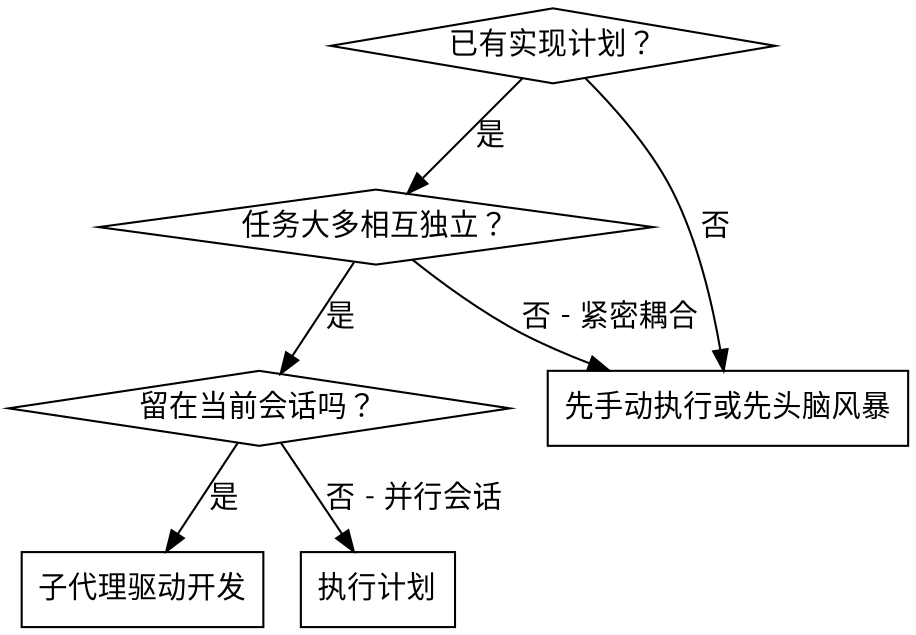
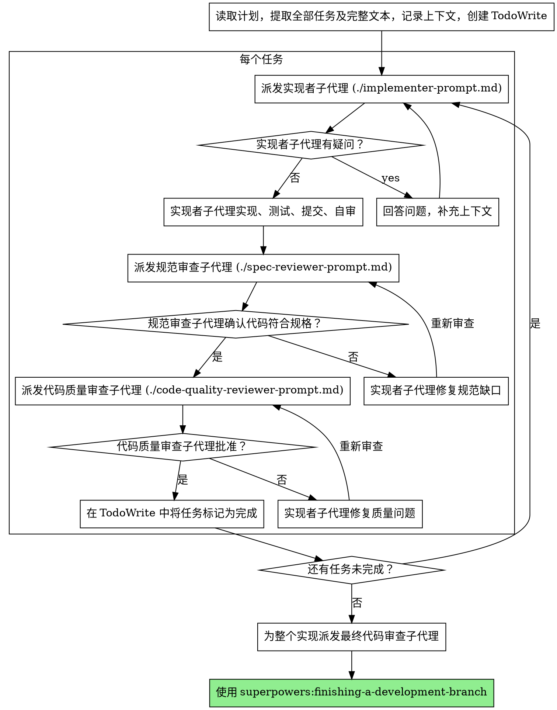

# 子代理驱动开发

通过为每个任务派发一个全新的子代理来执行计划，并在每个任务完成后进行两阶段评审：先做规范符合性审查，再做代码质量审查。

**为什么要用子代理：** 你把任务委派给具备专门上下文的代理。通过精确构造它们的指令和上下文，你可以确保它们保持专注并成功完成任务。它们绝不应继承你当前会话的上下文或历史，你需要只提供它们完成任务所需的内容。这也能把你的上下文留给协调工作使用。

**核心原则：** 每个任务一个新子代理 + 两阶段审查（先规范，再质量）= 高质量、快速迭代

## 何时使用



**对比执行计划（并行会话）：**
- 同一会话内执行（无需切换上下文）
- 每个任务一个新子代理（不会污染上下文）
- 每个任务完成后做两阶段审查：先规范，再质量
- 迭代更快（任务之间不需要人类介入）

## 过程



## 模型选择

为节省成本并提高速度，每个角色都使用能够胜任该工作的最弱模型。

**机械性的实现任务**（独立函数、规格清晰、1-2 个文件）：使用快速、便宜的模型。只要计划足够明确，大多数实现任务都属于机械性任务。

**集成与判断任务**（多文件协调、模式匹配、调试）：使用标准模型。

**架构、设计和评审任务**：使用当前可用的最强模型。

**任务复杂度信号：**
- 只涉及 1-2 个文件且有完整规格说明 → 便宜模型
- 涉及多个文件并带有集成问题 → 标准模型
- 需要设计判断或广泛理解代码库 → 最强模型

## 如何处理实现子代理的状态

实现子代理会返回四种状态中的一种。请相应处理：

**DONE：** 继续进行规范符合性审查。

**DONE_WITH_CONCERNS：** 实现已完成，但子代理标出了疑虑。先阅读这些疑虑，再继续审查。如果疑虑涉及正确性或范围，先处理后再审查；如果只是观察性意见（例如“这个文件正在变大”），记录下来并继续。

**NEEDS_CONTEXT：** 实现子代理缺少必要上下文。补充缺失信息后重新派发。

**BLOCKED：** 实现子代理无法完成任务。评估阻塞原因：
1. 如果是上下文问题，补充更多上下文并用相同模型重新派发
2. 如果任务需要更多推理，改用更强模型重新派发
3. 如果任务太大，把它拆得更小
4. 如果计划本身有问题，升级给人类

**绝不要** 忽略升级或在没有任何变化的情况下强迫同一模型重试。如果实现子代理说自己卡住了，就说明必须改变某些条件。

## 提示模板

- `./implementer-prompt.md` - 派发实现子代理
- `./spec-reviewer-prompt.md` - 派发规范符合性审查子代理
- `./code-quality-reviewer-prompt.md` - 派发代码质量审查子代理

## 示例流程

```
你：我要使用“子代理驱动开发”来执行这个计划。

[只读取一次计划文件：docs/superpowers/plans/feature-plan.md]
[提取全部 5 个任务及其完整文本]
[创建 TodoWrite，并写入全部任务]

任务 1：安装 hook 脚本

[获取任务 1 的文本和上下文（已经提取好了）]
[派发实现子代理，传入完整任务文本 + 上下文]

实现子代理：“开始前我有个问题 - 这个 hook 应该安装在用户级还是系统级？”

你：“用户级（~/.config/superpowers/hooks/）”

实现子代理：“收到。现在开始实现……”
[稍后] 实现子代理：
  - 已实现 install-hook 命令
  - 已运行测试，5/5 通过
  - 自查：发现漏掉了 --force 标志，已补上
  - 已提交

[派发规范符合性审查子代理]
规范审查：✅ 符合规范 - 所有要求都满足，没有额外内容

[获取 git SHA，派发代码质量审查子代理]
代码审查：优点：测试覆盖不错，代码整洁。问题：无。已批准。

[将任务 1 标记为完成]

任务 2：恢复模式

[获取任务 2 的文本和上下文（已经提取好了）]
[派发实现子代理，传入完整任务文本 + 上下文]

实现子代理：[没有问题，继续执行]
实现子代理：
  - 已添加 verify/repair 模式
  - 8/8 测试通过
  - 自查：一切正常
  - 已提交

[派发规范符合性审查子代理]
规范审查：❌ 发现问题：
  - 缺少：进度报告（规范写的是“每 100 项报告一次”）
  - 多余：添加了 --json 标志（规范未要求）

[实现子代理修复问题]
实现子代理：已移除 --json 标志，补充进度报告

[规范审查再次进行]
规范审查：✅ 现在符合规范

[派发代码质量审查子代理]
代码审查：优点：实现扎实。问题（重要）：存在魔法数字（100）

[实现子代理修复]
实现子代理：已把 100 提取为 `PROGRESS_INTERVAL` 常量

[代码审查再次进行]
代码审查：✅ 已批准

[将任务 2 标记为完成]

...

[全部任务完成后]
[派发最终代码审查子代理]
最终审查：所有要求都满足，可以合并

完成！
```

## 优势

**相较于手工执行：**
- 子代理天然遵循 TDD
- 每个任务都有新上下文（不会混淆）
- 支持并行执行（子代理之间不会互相干扰）
- 子代理在工作中可以提问（开始前和进行中都可以）

**相较于执行计划：**
- 同一会话内完成（无需交接）
- 持续推进（不必等待）
- 自动设置审查检查点

**效率收益：**
- 不需要额外读取文件的开销（控制器直接提供完整文本）
- 控制器精确筛选所需上下文
- 子代理一开始就拿到完整信息
- 在开始工作前就能暴露问题（不是事后）
