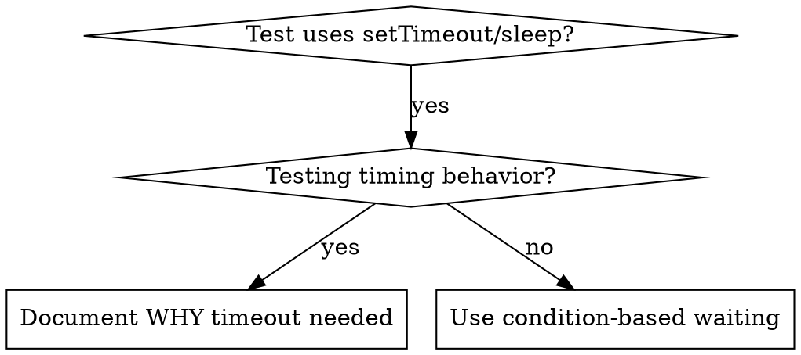

# 基于条件的等待

## 概述

脆弱测试常常用任意延迟去猜时间。这会制造竞态条件，让测试在快机器上通过、但在高负载或 CI 中失败。

**核心原则：** 等待你真正关心的那个条件，而不是猜它需要多久。

## 何时使用



**适用于：**
- 测试中有任意延迟（`setTimeout`、`sleep`、`time.sleep()`）
- 测试不稳定（有时通过，有时在高负载下失败）
- 测试并行运行时超时
- 等待异步操作完成

**不适用于：**
- 测试真实的时间行为（防抖、节流间隔）
- 如果必须使用任意超时，一定要写明 WHY

## 核心模式

```typescript
// ❌ 之前：在猜时间
await new Promise(r => setTimeout(r, 50));
const result = getResult();
expect(result).toBeDefined();

// ✅ 之后：等待条件
await waitFor(() => getResult() !== undefined);
const result = getResult();
expect(result).toBeDefined();
```

## 快速模式

| 场景 | 模式 |
|----------|---------|
| 等待事件 | `waitFor(() => events.find(e => e.type === 'DONE'))` |
| 等待状态 | `waitFor(() => machine.state === 'ready')` |
| 等待数量 | `waitFor(() => items.length >= 5)` |
| 等待文件 | `waitFor(() => fs.existsSync(path))` |
| 复杂条件 | `waitFor(() => obj.ready && obj.value > 10)` |

## 实现

通用轮询函数：
```typescript
async function waitFor<T>(
  condition: () => T | undefined | null | false,
  description: string,
  timeoutMs = 5000
): Promise<T> {
  const startTime = Date.now();

  while (true) {
    const result = condition();
    if (result) return result;

    if (Date.now() - startTime > timeoutMs) {
      throw new Error(`Timeout waiting for ${description} after ${timeoutMs}ms`);
    }

    await new Promise(r => setTimeout(r, 10)); // 每 10ms 轮询一次
  }
}
```

查看本目录中的 `condition-based-waiting-example.ts`，其中有完整实现和领域专用辅助函数（`waitForEvent`、`waitForEventCount`、`waitForEventMatch`），来自真实调试会话。

## 常见错误

**❌ 轮询太快：** `setTimeout(check, 1)` - 浪费 CPU
**✅ 修复：** 每 10ms 轮询一次

**❌ 没有超时：** 如果条件永远不满足，就会无限循环
**✅ 修复：** 始终带上超时，并给出清晰错误

**❌ 旧数据：** 在循环前缓存状态
**✅ 修复：** 在循环内调用 getter，确保拿到新鲜状态

## 什么时候任意超时是正确的

```typescript
// 工具每 100ms tick 一次 - 需要 2 个 tick 来验证部分输出
await waitForEvent(manager, 'TOOL_STARTED'); // 第一步：先等条件出现
await new Promise(r => setTimeout(r, 200));   // 第二步：再等待有时间特性的行为
// 200ms = 100ms 间隔下的 2 个 tick - 有文档说明且有理由
```

**要求：**
1. 先等待触发条件
2. 基于已知时序（不是猜）
3. 用注释解释 WHY

## 真实影响

来自调试会话（2025-10-03）：
- 修复了 3 个文件中的 15 个脆弱测试
- 通过率：60% → 100%
- 执行时间：快了 40%
- 不再有竞态条件
