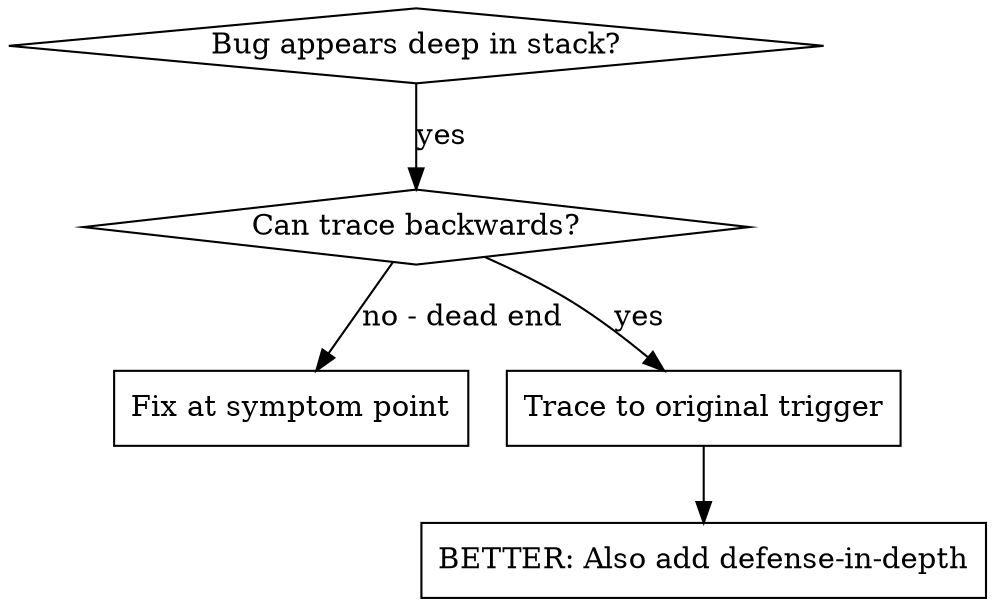
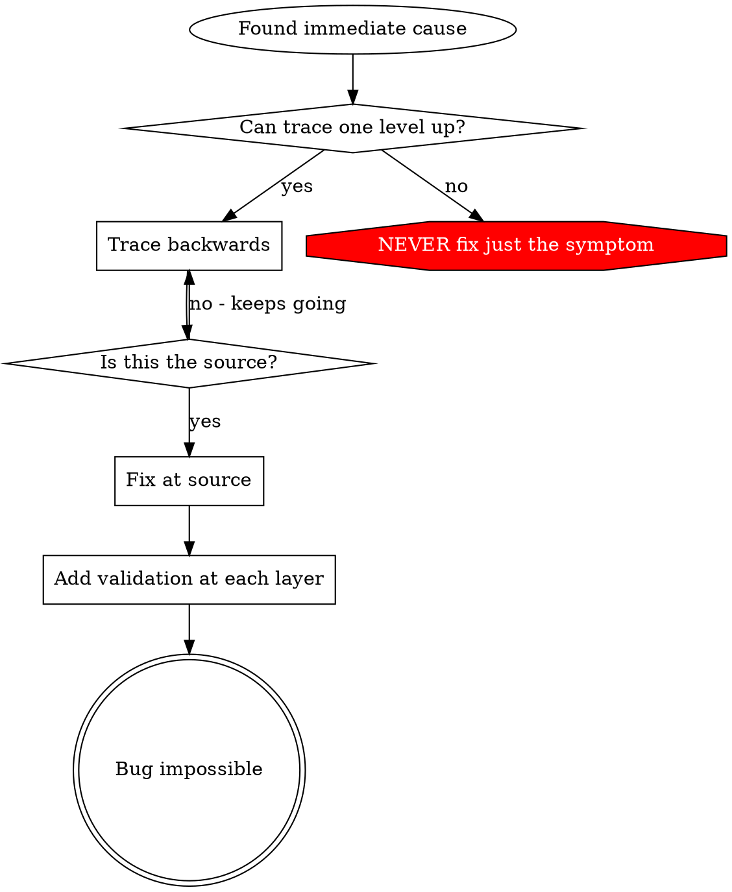

# 根因追踪

## 概述

bug 常常发生在很深的调用栈里（在错误目录里执行 `git init`、文件创建在错误位置、数据库以错误路径打开）。你的直觉可能是修复错误出现的地方，但那只是在处理症状。

**核心原则：** 沿着调用链向后追踪，直到找到原始触发点，然后在源头修复。

## 何时使用



**适用于：**
- 错误发生在执行深处（而不是入口点）
- 堆栈跟踪显示很长的调用链
- 不清楚无效数据最初从哪里来
- 需要找出到底是哪个测试/代码触发了问题

## 追踪流程

### 1. 观察症状
```
Error: git init failed in /Users/jesse/project/packages/core
```

### 2. 找到直接原因
**是什么代码直接导致了它？**
```typescript
await execFileAsync('git', ['init'], { cwd: projectDir });
```

### 3. 继续问：是谁调用的？
```typescript
WorktreeManager.createSessionWorktree(projectDir, sessionId)
  → called by Session.initializeWorkspace()
  → called by Session.create()
  → called by test at Project.create()
```

### 4. 继续向上追踪
**传入的值是什么？**
- `projectDir = ''`（空字符串！）
- 空字符串作为 `cwd` 会解析为 `process.cwd()`
- 那就是源码目录！

### 5. 找到原始触发点
**空字符串从哪里来的？**
```typescript
const context = setupCoreTest(); // Returns { tempDir: '' }
Project.create('name', context.tempDir); // Accessed before beforeEach!
```

## 添加堆栈跟踪

当你没法手动追踪时，添加埋点：

```typescript
// 在有问题的操作之前
async function gitInit(directory: string) {
  const stack = new Error().stack;
  console.error('DEBUG git init:', {
    directory,
    cwd: process.cwd(),
    nodeEnv: process.env.NODE_ENV,
    stack,
  });

  await execFileAsync('git', ['init'], { cwd: directory });
}
```

**关键：** 在测试中使用 `console.error()`（不要用 logger - 可能不会显示）

**运行并捕获：**
```bash
npm test 2>&1 | grep 'DEBUG git init'
```

**分析堆栈跟踪：**
- 看测试文件名
- 找到触发调用的行号
- 识别模式（同一个测试？同一个参数？）

## 找出哪个测试制造了污染

如果某些东西是在测试期间出现的，但你不知道是哪个测试：

使用本目录中的二分脚本 `find-polluter.sh`：

```bash
./find-polluter.sh '.git' 'src/**/*.test.ts'
```

它会逐个运行测试，找到第一个制造污染的测试后停止。用法见脚本本身。

## 真实示例：空 projectDir

**症状：** `.git` 被创建在 `packages/core/`（源码目录）

**追踪链路：**
1. `git init` 在 `process.cwd()` 中运行 ← 空 cwd 参数
2. WorktreeManager 传入了空的 projectDir
3. Session.create() 传了空字符串
4. 测试在 beforeEach 之前访问了 `context.tempDir`
5. `setupCoreTest()` 起初返回 `{ tempDir: '' }`

**根因：** 顶层变量初始化时访问了空值

**修复：** 把 tempDir 改成 getter，在 beforeEach 之前访问时直接抛错

**另外还加入了防御式设计：**
- 第 1 层：Project.create() 校验目录
- 第 2 层：WorkspaceManager 校验不能为空
- 第 3 层：NODE_ENV 保护，在测试中拒绝在 tmpdir 之外执行 git init
- 第 4 层：在 git init 前记录堆栈跟踪

## 关键原则



**永远不要只修错误出现的地方。** 要向后追踪，找到原始触发点。

## 堆栈跟踪建议

**在测试中：** 使用 `console.error()`，不要用 logger - logger 可能被屏蔽
**在操作之前：** 在危险操作前记录日志，而不是失败后再记
**包含上下文：** 目录、cwd、环境变量、时间戳
**捕获堆栈：** `new Error().stack` 会显示完整调用链

## 真实影响

来自调试会话（2025-10-03）：
- 通过 5 层追踪找到了根因
- 在源头修复了问题（getter 校验）
- 增加了 4 层防御
- 1847 个测试通过，零污染
