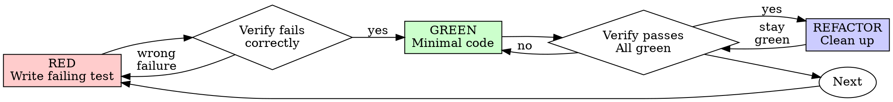

# 测试驱动开发（TDD）

## 概述

先写测试。看着它失败。再写最少的代码让它通过。

**核心原则：** 如果你没有亲眼看着测试失败，你就不知道它是不是在测试正确的东西。

**违背规则字面意思，就是违背规则精神。**

## 何时使用

**始终使用：**
- 新功能
- 缺陷修复
- 重构
- 行为变更

**例外情况（先问人类协作方）：**
- 一次性原型
- 生成代码
- 配置文件

如果你在想“这次先跳过 TDD 吧”？停下。这是在自我合理化。

## 铁律

```
没有先写失败的测试，就不要写生产代码
```

先写了代码再写测试？删掉它。重来。

**没有例外：**
- 不要把它留作“参考”
- 不要在写测试时“适配”它
- 不要看它
- 删掉就是删掉

从测试重新实现。仅此而已。

## 红 - 绿 - 重构



### RED - 写失败的测试

只写一个最小测试，说明应该发生什么。

<Good>
```typescript
test('retries failed operations 3 times', async () => {
  let attempts = 0;
  const operation = () => {
    attempts++;
    if (attempts < 3) throw new Error('fail');
    return 'success';
  };

  const result = await retryOperation(operation);

  expect(result).toBe('success');
  expect(attempts).toBe(3);
});
```
名称清晰，测试真实行为，只测试一件事
</Good>

<Bad>
```typescript
test('retry works', async () => {
  const mock = jest.fn()
    .mockRejectedValueOnce(new Error())
    .mockRejectedValueOnce(new Error())
    .mockResolvedValueOnce('success');
  await retryOperation(mock);
  expect(mock).toHaveBeenCalledTimes(3);
});
```
名称含糊，测试的是 mock，不是真实代码
</Bad>

**要求：**
- 只测试一个行为
- 名称要清晰
- 使用真实代码（除非别无选择，否则不要用 mock）

### 验证 RED - 亲眼看着它失败

**强制要求。绝不能跳过。**

```bash
npm test path/to/test.test.ts
```

确认：
- 测试失败了（不是报错）
- 失败信息是符合预期的
- 失败原因是功能缺失（不是拼写错误）

**测试通过了？** 说明你测试的是已有行为。修正测试。

**测试报错了？** 先修错误，再运行，直到它正确失败。

### GREEN - 最小实现

写最简单的代码，让测试通过。

<Good>
```typescript
async function retryOperation<T>(fn: () => Promise<T>): Promise<T> {
  for (let i = 0; i < 3; i++) {
    try {
      return await fn();
    } catch (e) {
      if (i === 2) throw e;
    }
  }
  throw new Error('unreachable');
}
```
只写到刚好通过测试为止
</Good>

<Bad>
```typescript
async function retryOperation<T>(
  fn: () => Promise<T>,
  options?: {
    maxRetries?: number;
    backoff?: 'linear' | 'exponential';
    onRetry?: (attempt: number) => void;
  }
): Promise<T> {
  // YAGNI
}
```
过度设计
</Bad>

不要额外加功能，不要重构其他代码，也不要为了“顺手改进”超出测试范围。

### 验证 GREEN - 亲眼看着它通过

**强制要求。**

```bash
npm test path/to/test.test.ts
```

确认：
- 测试通过
- 其他测试仍然通过
- 输出干净（没有错误、没有警告）

**测试失败？** 修代码，不要修测试。

**其他测试失败？** 现在就修。

### REFACTOR - 清理

只有在变绿之后才做：
- 去除重复
- 改进命名
- 提取辅助函数

保持测试为绿色。不要增加行为。

### 重复

为下一个功能编写下一个失败测试。

## 好测试

| 质量 | 好 | 差 |
|---------|------|-----|
| **最小化** | 一件事。名字里有 `and`？拆开。 | `test('validates email and domain and whitespace')` |
| **清晰** | 名称描述行为 | `test('test1')` |
| **表达意图** | 展示期望的 API | 让人看不出代码应该做什么 |

## 为什么顺序很重要

**“我会先把测试放后面写，用来验证它能工作。”**

在代码之后写的测试会立刻通过。立刻通过并不能证明什么：
- 可能测试错了东西
- 可能测试的是实现，而不是行为
- 可能漏掉了你忘记的边界情况
- 你从来没有看着它抓住那个 bug

先写测试会迫使你看到它失败，这能证明它确实在测试某些东西。

**“我已经手动测试过所有边界情况了。”**

手动测试是临时性的。你以为你测全了，但：
- 没有测试记录
- 代码变了之后无法重新运行
- 在压力下很容易漏掉情况
- “我试的时候它能跑” ≠ 全面

自动化测试才是系统性的。每次运行方式都一样。

**“删掉我已经写了 X 小时的代码太浪费了。”**

这是沉没成本谬误。时间已经花掉了。你现在只有两个选择：
- 删掉并用 TDD 重写（再花 X 小时，但信心高）
- 留着它，之后再补测试（30 分钟，信心低，很可能有 bug）

真正的浪费，是保留你无法信任的代码。没有真实测试的可运行代码，就是技术债。

**“TDD 太教条了，务实就应该灵活调整。”**

TDD 本身就是务实的：
- 在提交前发现 bug（比提交后调试更快）
- 防止回归（测试会立刻发现破坏）
- 文档化行为（测试展示了代码如何被使用）
- 便于重构（可以自由修改，测试会捕捉破坏）

“务实”的捷径 = 在生产环境里调试 = 更慢。

**“先写测试和后写测试达到的是同样的目标 - 只是精神不同，不是仪式不同”**

不是。后写测试回答“这段代码做了什么？”，先写测试回答“这段代码应该做什么？”

后写测试会被你的实现所偏置。你测试的是你已经构建出来的东西，而不是需求本身。你验证的是你记住的边界情况，而不是你发现的边界情况。

先写测试会迫使你在实现之前发现边界情况。后写测试只是在验证你是否记住了所有东西（而你没有）。

实现后花 30 分钟补测试 ≠ TDD。你得到的是覆盖率，失去的是测试确实有效的证明。

## 常见自我合理化

| 借口 | 现实 |
|--------|---------|
| “太简单了，不值得测试” | 简单代码也会坏。写测试只要 30 秒。 |
| “我会在后面测试” | 测试一开始就通过，什么都证明不了。 |
| “先写后写达到相同目标” | 后写测试 = “这段代码做了什么？” 先写测试 = “这段代码应该做什么？” |
| “我已经手动测试过了” | 临时测试 ≠ 系统性测试。没有记录，也不能重跑。 |
| “删掉我花了 X 小时的代码太浪费” | 这是沉没成本谬误。保留未经验证的代码才是技术债。 |
| “先留着当参考，测试后面再写” | 你会去适配它。那就是在后写测试。删掉才是真的删掉。 |
| “我需要先探索一下” | 可以。把探索内容全部丢掉，然后从 TDD 重新开始。 |
| “测试太难说明设计不清晰” | 听测试的。难测试 = 难使用。 |
| “TDD 会拖慢我” | TDD 比调试更快。务实 = 先测试。 |
| “手动测试更快” | 手动测试不能证明边界情况。每次改动你都要重测。 |
| “现有代码没有测试” | 那就改好它。给现有代码补测试。 |

## 红旗 - 停下并重来

- 先写了代码再写测试
- 在实现之后才补测试
- 测试一开始就通过
- 说不清测试为什么失败
- 测试是“之后再加”的
- 为“就这一次”找理由
- “我已经手动测试过了”
- “先写后写达到同样目的”
- “这关乎精神，不是仪式”
- “留作参考”或“改造已有代码”
- “已经花了 X 小时，删掉太浪费”
- “TDD 太教条了，我这是务实”
- “这次不一样，因为...”

**这些情况都意味着：删掉代码。用 TDD 重新开始。**

## 示例：修复 bug

**Bug：** 空邮箱被接受

**RED**
```typescript
test('rejects empty email', async () => {
  const result = await submitForm({ email: '' });
  expect(result.error).toBe('Email required');
});
```

**验证 RED**
```bash
$ npm test
FAIL: expected 'Email required', got undefined
```

**GREEN**
```typescript
function submitForm(data: FormData) {
  if (!data.email?.trim()) {
    return { error: 'Email required' };
  }
  // ...
}
```

**验证 GREEN**
```bash
$ npm test
PASS
```

**REFACTOR**
如果需要，可以把多个字段的校验提取出来。

## 验证清单

在标记工作完成之前：

- [ ] 每个新函数/方法都有测试
- [ ] 亲眼看着每个测试在实现前失败
- [ ] 每个测试都因为预期原因失败（功能缺失，不是拼写错误）
- [ ] 写了最少的代码让每个测试通过
- [ ] 所有测试都通过
- [ ] 输出干净（没有错误、没有警告）
- [ ] 测试使用真实代码（只有在别无选择时才用 mock）
- [ ] 覆盖了边界情况和错误情况

这些项没法全打勾？说明你跳过了 TDD。重来。

## 卡住时

| 问题 | 解决方案 |
|---------|----------|
| 不知道怎么测试 | 先写你想要的 API。先写断言。问问人类协作方。 |
| 测试太复杂 | 设计太复杂。简化接口。 |
| 必须 mock 所有东西 | 代码耦合太紧。使用依赖注入。 |
| 测试设置太大 | 提取辅助函数。还是太复杂？简化设计。 |

## 调试集成

发现 bug 了？写一个能复现它的失败测试。遵循 TDD 循环。测试可以证明修复并防止回归。

永远不要在没有测试的情况下修 bug。

## 测试反模式

添加 mock 或测试工具时，阅读 `@testing-anti-patterns.md`，以避免常见坑：
- 测试 mock 的行为，而不是真实行为
- 给生产类添加只给测试用的方法
- 在不了解依赖的情况下就去 mock

## 最终规则

```
生产代码 → 测试已存在且先失败过
否则 → 不是 TDD
```

没有人类协作方的许可，不允许例外。
