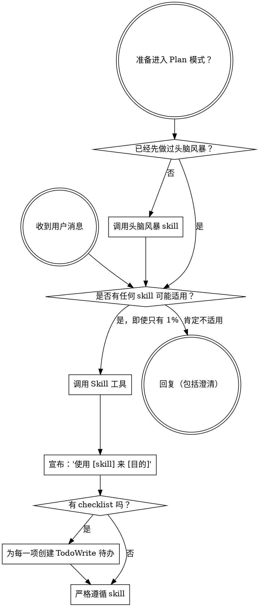

<SUBAGENT-STOP>
如果你是被分派来执行某个具体任务的子代理，请跳过这个 skill。
</SUBAGENT-STOP>

<EXTREMELY-IMPORTANT>
如果你认为某个 skill 有哪怕 1% 的可能适用于你正在做的事情，你都绝对必须调用该 skill。

如果某个 skill 适用于你的任务，你没有选择。你必须使用它。

这不是商量，这不是可选项。你不能用任何理由绕过去。
</EXTREMELY-IMPORTANT>

## 指令优先级

Superpowers skills 会覆盖默认系统提示词行为，但**用户指令始终优先**：

1. **用户的显式指令**（CLAUDE.md、GEMINI.md、AGENTS.md、直接请求）- 最高优先级
2. **Superpowers skills** - 在与用户指令冲突时覆盖默认系统行为
3. **默认系统提示词** - 最低优先级

如果 CLAUDE.md、GEMINI.md 或 AGENTS.md 说“不要使用 TDD”，而某个 skill 说“始终使用 TDD”，那就遵循用户指令。用户说了算。

## 如何访问技能

**在 Claude Code 中：** 使用 `Skill` 工具。调用 skill 时，它的内容会被加载并展示给你 - 直接遵循它。绝不要对 skill 文件使用 Read 工具。

**在 Copilot CLI 中：** 使用 `skill` 工具。Skills 会从已安装的插件中自动发现。`skill` 工具的工作方式和 Claude Code 的 `Skill` 工具相同。

**在 Gemini CLI 中：** Skills 通过 `activate_skill` 工具激活。Gemini 会在会话开始时加载 skill 元数据，并在需要时激活完整内容。

**在其他环境中：** 请查看对应平台文档，了解 skills 是如何加载的。

## 平台适配

Skills 使用的是 Claude Code 的工具名。在非 CC 平台上，请参考 `references/copilot-tools.md`（Copilot CLI）和 `references/codex-tools.md`（Codex）中的工具对应关系。

# 使用 Skills

## 规则

**在任何回复或行动之前，先调用相关或被请求的 skills。** 即使只有 1% 的可能性表明某个 skill 可能适用，你也应该调用 skill 去确认。若被调用的 skill 最终并不适用于当前情境，你不必使用它。

## 红旗信号

下面这些想法意味着你该停下来 - 你正在用借口合理化自己的行为：

| 想法 | 现实 |
|---------|---------|
| “这只是个简单问题” | 问题也是任务。先检查有没有 skill。 |
| “我需要更多上下文” | 在提问之前，先做 skill 检查。 |
| “我先看一下代码库” | skills 会告诉你该怎么探索。先检查。 |
| “我可以先快速看看 git/文件” | 文件看不到对话上下文。先检查 skills。 |
| “我先收集一些信息” | skills 会告诉你该怎么收集信息。 |
| “这不需要正式的 skill” | 只要有 skill，就该用。 |
| “我记得这个 skill” | skills 会变化。读当前版本。 |
| “这不算任务” | 有动作就是任务。先检查 skills。 |
| “这个 skill 太重了” | 简单的事也会变复杂。用它。 |
| “我先做这一件事” | 在做任何事之前先检查。 |
| “这感觉很有效率” | 无纪律的行动会浪费时间。skills 能避免这种情况。 |
| “我知道那是什么意思” | 知道概念不等于用了 skill。先调用它。 |

## Skill 优先级

当多个 skills 都可能适用时，按以下顺序使用：

1. **流程类 skills 优先**（头脑风暴、调试）- 它们决定要如何处理任务
2. **实现类 skills 其次**（frontend-design、mcp-builder）- 它们指导具体执行

“我们来构建 X” -> 先头脑风暴，再使用实现类 skills。
“修复这个 bug” -> 先调试，再用领域相关的 skill。

## Skill 类型

**严格型**（TDD、调试）：必须严格遵循，不要把纪律性改没了。

**灵活型**（模式）：根据上下文调整原则。

skill 本身会告诉你它属于哪一类。

## 用户指令

指令说明的是 WHAT，而不是 HOW。“添加 X”或“修复 Y”并不意味着可以跳过工作流。
