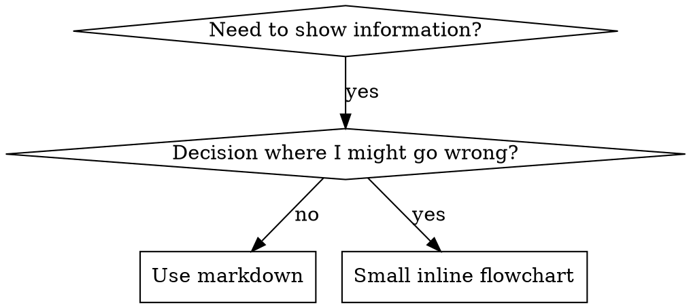

# 编写技能

## 概览

**编写技能，就是把测试驱动开发应用到流程文档上。**

**个人技能存放在代理专属目录中**（Claude Code 使用 `~/.claude/skills`，Codex 使用 `~/.agents/skills/`）

你的工作方式是：先写测试用例（通过子代理制造高压场景），观察它们失败（基线行为），再编写技能（文档），看测试通过（代理遵循规则），最后重构（堵住漏洞）。

**核心原则：**如果你没有先看见一个没有技能时会失败的代理，就不知道这个技能是不是在教正确的东西。

**必须的背景：**在使用本技能前，你必须先理解 `superpowers:test-driven-development`。那个技能定义了基础的 RED-GREEN-REFACTOR 循环；本技能只是把 TDD 迁移到文档上。

**官方指导：**关于 Anthropic 的官方技能编写最佳实践，请参见 `anthropic-best-practices.md`。这份文档提供的是与本技能的 TDD 取向互补的额外模式和指导。

## 什么是技能？

**技能** 是一份参考指南，记录经过验证的技巧、模式或工具。技能帮助未来的 Claude 实例找到并应用有效方法。

**技能是：**可复用的技巧、模式、工具、参考指南

**技能不是：**“我曾经这样解决过一个问题”的叙事

## 技能的 TDD 映射

| TDD 概念 | 技能创建 |
|-------------|----------------|
| **测试用例** | 使用子代理制造高压场景 |
| **生产代码** | 技能文档（`SKILL.md`） |
| **测试失败（RED）** | 没有技能时代理违反规则（基线） |
| **测试通过（GREEN）** | 加入技能后代理遵循规则 |
| **重构** | 在保持遵循的前提下堵住漏洞 |
| **先写测试** | 在写技能前先跑基线场景 |
| **亲眼看它失败** | 记录代理使用的具体合理化说辞 |
| **最少代码** | 只写足以应对这些具体违规的技能 |
| **亲眼看它通过** | 验证代理现在遵循规则 |
| **重构循环** | 发现新的合理化说辞 → 堵上 → 重新验证 |

整个技能创建过程遵循 RED-GREEN-REFACTOR。

## 什么时候创建技能

**适合创建：**
- 这项技巧对你来说并不直观
- 你会在多个项目中再次引用它
- 该模式适用于广泛场景，而非项目专属
- 其他人也会受益

**不适合创建：**
- 一次性解决方案
- 已经在其他地方充分记录的标准实践
- 项目专属约定（放到 `CLAUDE.md`）
- 机械性约束（如果可以用正则或校验强制执行，就自动化，别用文档去写判断题）

## 技能类型

### 技巧
带有明确步骤的具体方法（例如 `condition-based-waiting`、`root-cause-tracing`）

### 模式
描述思考问题的方式（例如 `flatten-with-flags`、`test-invariants`）

### 参考
API 文档、语法指南、工具文档（例如 office 文档）

## 目录结构

```text
skills/
  skill-name/
    SKILL.md              # 主参考文件（必需）
    supporting-file.*     # 仅在需要时添加
```

**扁平命名空间** - 所有技能都放在同一个可搜索命名空间中

**以下内容拆分成单独文件：**
1. **重型参考**（100 行以上）- API 文档、完整语法
2. **可复用工具** - 脚本、实用工具、模板

**以下内容内联保留：**
- 原则和概念
- 代码模式（< 50 行）
- 其他所有内容

## `SKILL.md` 结构

**Frontmatter（YAML）：**
- 两个必需字段：`name` 和 `description`（完整支持字段见 [agentskills.io/specification](https://agentskills.io/specification)）
- 总长度最多 1024 个字符
- `name`：只使用字母、数字和连字符（不能有括号或特殊字符）
- `description`：第三人称，只描述“何时使用”（不要写“做什么”）
  - 以 “Use when...” 开头，强调触发条件
  - 包含具体症状、场景和上下文
  - **绝不要概述技能的流程或工作流**（原因见 CSO 部分）
  - 如果可能，控制在 500 字符以内

```markdown
---
name: Skill-Name-With-Hyphens
description: Use when [specific triggering conditions and symptoms]
---

# Skill Name

## Overview
这是什么？用 1-2 句话说明核心原则。

## When to Use
[如果决策不明显，可画一个简短的内联流程图]

包含症状和使用场景的要点列表
什么时候不要用

## Core Pattern (for techniques/patterns)
前后代码对照

## Quick Reference
用于快速扫描常见操作的表格或要点

## Implementation
简单模式用内联代码
重型参考或可复用工具用文件链接

## Common Mistakes
哪里会出错 + 如何修正

## Real-World Impact (optional)
具体结果
```

## Claude 搜索优化（CSO）

**发现能力的关键：**未来 Claude 必须能找到你的技能

### 1. 丰富的 description 字段

**目的：**Claude 会读 description 来决定加载哪些技能。它回答的是：“我现在要不要读这个技能？”

**格式：**以 “Use when...” 开头，聚焦触发条件

**关键：description = 何时使用，不是技能做什么**

description 只能描述触发条件，不能总结技能的过程或工作流。

**为什么这很重要：**测试表明，如果 description 总结了工作流，Claude 可能直接照着 description 做，而不是阅读完整技能内容。比如一个写着“任务之间做代码审查”的 description，Claude 可能只做一次审查，尽管技能正文明确要求两次审查（先规范，再代码质量）。

当 description 改成只写“Use when executing implementation plans with independent tasks in the current session”（不总结流程）时，Claude 才会正确阅读流程图并执行两阶段审查。

**陷阱：**概述工作流的 description 会让 Claude 走捷径，技能正文反而被跳过。

```yaml
# ❌ 错误：总结了流程 - Claude 可能直接照着它做，而不是读正文
description: Use when executing plans - dispatches subagent per task with code review between tasks

# ❌ 错误：过程细节太多
description: Use for TDD - write test first, watch it fail, write minimal code, refactor

# ✅ 正确：只写触发条件，不写流程概述
description: Use when executing implementation plans with independent tasks in the current session

# ✅ 正确：只写触发条件
description: Use when implementing any feature or bugfix, before writing implementation code
```

**内容：**
- 使用具体触发条件、症状和场景来表明该技能适用
- 描述的是“问题”（竞态条件、行为不一致），而不是“语言特有症状”（`setTimeout`、`sleep`）
- 触发条件尽量与技术无关，除非该技能本身就是技术专用
- 如果是技术专用技能，就明确写出来
- 使用第三人称（会被注入系统提示词）
- **绝不要总结技能的流程或工作流**

```yaml
# ❌ 错误：太抽象、太模糊，没有说明何时使用
description: For async testing

# ❌ 错误：第一人称
description: I can help you with async tests when they're flaky

# ❌ 错误：提到了技术，但技能本身并不是专门针对它
description: Use when tests use setTimeout/sleep and are flaky

# ✅ 正确：以 "Use when" 开头，描述问题，不写流程
description: Use when tests have race conditions, timing dependencies, or pass/fail inconsistently

# ✅ 正确：技术专用技能，触发条件写清楚
description: Use when using React Router and handling authentication redirects
```

### 2. 关键词覆盖

使用 Claude 可能会搜索的词：
- 错误消息：`Hook timed out`、`ENOTEMPTY`、`race condition`
- 症状：`flaky`、`hanging`、`zombie`、`pollution`
- 同义词：`timeout/hang/freeze`、`cleanup/teardown/afterEach`
- 工具：真实命令、库名、文件类型

### 3. 命名要清晰

**使用主动语态，以动词开头：**
- ✅ `creating-skills` 而不是 `skill-creation`
- ✅ `using-skills` 而不是 `skill-usage`
- ✅ `flatten-with-flags` 而不是 `data-structure-refactoring`
- ✅ `root-cause-tracing` 而不是 `debugging-techniques`

**动名词（-ing）很适合描述流程：**
- `creating-skills`、`testing-skills`、`debugging-with-logs`
- 主动、明确描述你正在做的动作

### 4. 跨引用其他技能

**在编写引用其他技能的文档时：**

只使用技能名，并加上明确的必需标记：
- ✅ 好：`**REQUIRED SUB-SKILL:** Use superpowers:test-driven-development`
- ✅ 好：`**REQUIRED BACKGROUND:** You MUST understand superpowers:systematic-debugging`
- ❌ 坏：`See skills/testing/test-driven-development`（不清楚是不是必须）
- ❌ 坏：`@skills/testing/test-driven-development/SKILL.md`（会强制加载，浪费上下文）

**为什么不用 `@` 链接：**`@` 语法会立即强制加载文件，消耗 200k+ 上下文，而不是按需读取。

## 流程图用法



**只在以下情况使用流程图：**
- 不明显的决策点
- 可能过早停下的流程循环
- “A 还是 B” 这种选择

**不要把流程图用在：**
- 参考材料 → 表格、列表
- 代码示例 → Markdown 块
- 线性步骤 → 编号列表
- 没有语义意义的标签（`step1`、`helper2`）

见 `graphviz-conventions.dot` 了解 Graphviz 风格规则。

**给你的协作方看图：**使用本目录中的 `render-graphs.js` 把技能流程图渲染为 SVG：
```bash
./render-graphs.js ../some-skill           # 每张图单独渲染
./render-graphs.js ../some-skill --combine # 合并成一张 SVG
```

## 代码示例

**一个优秀示例胜过很多平庸示例**

选择最相关的语言：
- 测试技巧 → TypeScript/JavaScript
- 系统调试 → Shell/Python
- 数据处理 → Python

**好示例：**
- 完整且可运行
- 注释清楚，解释为什么这么做
- 来自真实场景
- 清晰展示模式
- 可以直接改造使用，而不是空模板

**不要：**
- 用 5 种以上语言实现
- 制作填空模板
- 写牵强附会的例子

你擅长移植代码，所以一个好示例就够了。

## 文件组织

### 自包含技能
```text
defense-in-depth/
  SKILL.md    # 所有内容都内联
```
适用场景：内容都能放下，不需要重型参考

### 带可复用工具的技能
```text
condition-based-waiting/
  SKILL.md    # 概览 + 模式
  example.ts  # 可直接改造的工作代码
```
适用场景：工具是可复用代码，而不是纯叙述

### 带重型参考的技能
```text
pptx/
  SKILL.md       # 概览 + 工作流
  pptxgenjs.md   # 600 行 API 参考
  ooxml.md       # 500 行 XML 结构
  scripts/       # 可执行工具
```
适用场景：参考材料太大，不适合内联

## 铁律（和 TDD 一样）

```text
没有先经过失败测试，就不要写技能
```

这条规则适用于新技能，也适用于对现有技能的编辑。

先写技能再测试？删掉，重来。
没测试就编辑技能？同样违规。

**没有例外：**
- 不是“只是加一点内容”
- 不是“只是加一个章节”
- 不是“只是文档更新”
- 不要把未测试的改动当成“参考”
- 不要在测试时“顺便适配”
- 删除就是删除

**必须的背景：**`superpowers:test-driven-development` 解释了为什么这件事重要。对文档来说，原则完全一样。

## 针对不同技能类型的测试

不同技能类型需要不同的测试方法：

### 纪律约束型技能（规则/要求）

**例子：**TDD、先验证再完成、先设计再编码

**测试方式：**
- 学术型提问：他们是否理解规则？
- 高压场景：他们在压力下是否仍遵守？
- 组合多个压力：时间 + 沉没成本 + 疲惫
- 找出合理化说辞，并加入明确反制

**成功标准：**代理在最大压力下依然遵守规则

### 技巧型技能（how-to 指南）

**例子：**`condition-based-waiting`、`root-cause-tracing`、`defensive-programming`

**测试方式：**
- 应用场景：他们能否正确应用技巧？
- 变化场景：他们能否处理边界情况？
- 缺失信息测试：说明里有没有漏洞？

**成功标准：**代理能在新场景中成功应用技巧

### 参考型技能（API、语法、工具）

**例子：**API 文档、语法指南、工具说明

**测试方式：**
- 查找特定信息
- 解析文档结构
- 验证信息是否准确完整

**成功标准：**代理能快速找到并正确使用参考信息

## 实际工作中的评估

### 创建评估

**先创建评估，再写大量文档。** 这样可以确保你的技能解决的是实际问题，而不是想象出来的问题。

**评估驱动开发：**

1. **识别缺口**：在没有技能的情况下，让 Claude 处理代表性任务。记录具体失败或缺失的上下文。
2. **创建评估**：构建三个测试这些缺口的场景。
3. **建立基线**：在没有技能的情况下衡量 Claude 的表现。
4. **编写最少指令**：只写足够弥补缺口并通过评估的内容。
5. **迭代**：执行评估，对比基线，再继续打磨。

这个方法能确保你解决的是实际问题，而不是提前预设一个未必会出现的需求。

**评估结构：**

```json
{
  "skills": ["pdf-processing"],
  "query": "Extract all text from this PDF file and save it to output.txt",
  "files": ["test-files/document.pdf"],
  "expected_behavior": [
    "Successfully reads the PDF file using an appropriate PDF processing library or command-line tool",
    "Extracts text content from all pages in the document without missing any pages",
    "Saves the extracted text to a file named output.txt in a clear, readable format"
  ]
}
```

<Note>
  这个示例展示了一个带有简单测试标准的数据驱动评估。我们目前没有内置的方式来运行这些评估；用户可以自己构建评估系统。评估是衡量技能有效性的事实依据。
</Note>

### 与 Claude 迭代开发技能

最有效的技能开发流程本身就要用 Claude。让一个 Claude 实例（“Claude A”）帮你创建技能，供另一个实例（“Claude B”）使用。Claude A 帮你设计和打磨说明，Claude B 在真实任务中测试它们。之所以有效，是因为 Claude 模型既理解如何写有效的代理指令，也理解代理需要哪些信息。

**创建新技能：**

1. **先用没有技能的方式完成任务**：和 Claude A 一起按正常提示完成一个问题。在过程中，你会自然提供上下文、解释偏好、分享流程知识。注意哪些信息你反复在讲。

2. **识别可复用模式**：任务结束后，找出哪些上下文对类似未来任务也有用。

   **示例**：如果你做过一次 BigQuery 分析，你可能会提供表名、字段定义、过滤规则（例如“始终排除测试账号”）和常见查询模式。

3. **让 Claude A 创建技能**：“创建一个技能，捕捉我们刚才使用的 BigQuery 分析模式。把表结构、命名约定，以及过滤测试账号的规则都包含进去。”

   <Tip>
     Claude 模型天然理解技能格式和结构。你不需要特殊的系统提示，也不需要一个“编写技能”的技能来让 Claude 帮你创建技能。只要直接让 Claude 创建技能，它就会生成结构正确的 `SKILL.md`，包含合适的 frontmatter 和正文。
   </Tip>

4. **检查是否足够简洁**：确认 Claude A 没有加多余解释。可以问：“把关于什么是 win rate 的解释删掉，Claude 已经知道了。”

5. **改进信息架构**：让 Claude A 用更好的方式组织内容。比如：“把表结构单独放到参考文件里。以后我们可能会加更多表。”

6. **在相似任务上测试**：使用 Claude B（加载了技能的新实例）处理相关用例。观察它是否能找到正确的信息、正确应用规则并完成任务。

7. **根据观察继续迭代**：如果 Claude B 有困难或漏掉了什么，就带着具体情况回到 Claude A：“Claude 使用这个技能时，忘了在 Q4 按日期过滤。要不要加一节关于日期过滤的模式？”

**迭代现有技能：**

同样的层级模式也适用于改进现有技能。你在下面这些角色之间交替：

* **和 Claude A 合作**（帮助你细化技能的专家）
* **用 Claude B 测试**（实际执行工作的代理）
* **观察 Claude B 的行为**，把发现带回 Claude A

1. **在真实工作流里使用技能**：给 Claude B（加载了技能）真实任务，而不是测试题。

2. **观察 Claude B 的行为**：记录它哪里卡住、哪里成功、哪里做了意外选择。

   **观察示例**：“我让 Claude B 生成一个区域销售报告时，它写出了查询，但忘了排除测试账号，尽管技能里提到了这个规则。”

3. **回到 Claude A 改进**：把当前 `SKILL.md` 发给它，并描述你观察到的行为。可以问：“我注意到 Claude B 在生成区域报告时忘了过滤测试账号。技能里提到了过滤，但也许不够显眼？”

4. **查看 Claude A 的建议**：Claude A 可能会建议重组内容，让规则更突出，使用更强的措辞（比如把“总是过滤”改成“MUST filter”），或者重写工作流部分。

5. **应用并测试改动**：根据 Claude A 的建议更新技能，然后在相似请求上再次测试 Claude B。

6. **根据使用继续重复**：随着新场景出现，持续“观察-改进-测试”循环。每次迭代都基于真实代理行为，而不是假设。

**收集团队反馈：**

1. 把技能分享给队友并观察他们怎么用
2. 问：技能是否在预期时触发？说明是否清楚？还缺什么？
3. 吸收反馈，补上你自己使用模式中的盲点

**为什么这种方法有效：**Claude A 理解代理需求，你提供领域知识，Claude B 通过真实使用暴露缺口，而迭代优化则基于观察到的行为而不是假设。

### 观察 Claude 如何浏览技能

在迭代技能时，要注意 Claude 在实践中到底是怎么用它的。重点观察：

* **意料之外的浏览路径**：Claude 是否按你没预料到的顺序读文件？这可能说明你的结构不够直观
* **遗漏的连接**：Claude 是否没跟到重要文件的引用？你的链接可能需要更明确或更显眼
* **对某些部分过度依赖**：如果 Claude 反复读同一个文件，考虑这些内容是否应该放进主 `SKILL.md`
* **被忽略的内容**：如果 Claude 从不访问某个附属文件，那它可能是多余的，或者在主说明里信号不够强

根据这些观察迭代，不要凭假设。技能元数据里的 `name` 和 `description` 尤其关键。Claude 会用它们来判断当前任务是否应该触发该技能。要确保它们清楚描述技能是什么，以及什么时候该用。

## 要避免的反模式

### 避免 Windows 风格路径

无论在什么平台，都始终使用正斜杠：

* ✓ **好**：`scripts/helper.py`、`reference/guide.md`
* ✗ **避免**：`scripts\helper.py`、`reference\guide.md`

Unix 风格路径可跨平台使用，而 Windows 风格路径在 Unix 系统上会出错。

### 避免给太多选项

除非必要，不要同时给出多个方案：

```markdown
**坏例子：选项太多**（令人困惑）：
"你可以用 pypdf，或者 pdfplumber，或者 PyMuPDF，或者 pdf2image，或者……"

**好例子：给出默认值**（保留出口）：
"用于文本提取，使用 pdfplumber：
```python
import pdfplumber
```

如果是需要 OCR 的扫描版 PDF，则改用 pdf2image + pytesseract。"
```

## 高级：带可执行代码的技能

下面这些内容适用于包含可执行脚本的技能。如果你的技能只有 Markdown 指令，可以跳到 [有效技能检查清单](#checklist-for-effective-skills)。

### 解决问题，不要甩锅

编写技能脚本时，要自己处理错误，而不是把问题推回 Claude。

**好例子：显式处理错误**：

```python
def process_file(path):
    """处理文件；如果文件不存在，就创建它。"""
    try:
        with open(path) as f:
            return f.read()
    except FileNotFoundError:
        # 与其失败，不如创建默认内容
        print(f"文件 {path} 未找到，正在创建默认文件")
        with open(path, 'w') as f:
            f.write('')
        return ''
    except PermissionError:
        # 提供替代方案，而不是直接失败
        print(f"无法访问 {path}，改用默认值")
        return ''
```

**坏例子：把问题丢给 Claude**

```python
def process_file(path):
    # 直接失败，让 Claude 自己想办法
    return open(path).read()
```

配置参数也应该有理由并写清楚，避免“玄学常量”（Ousterhout 定律）。如果你自己都不知道该取什么值，Claude 又怎么判断？

**好例子：自解释**

```python
# HTTP 请求通常会在 30 秒内完成
# 更长的超时是为了应对慢连接
REQUEST_TIMEOUT = 30

# 三次重试兼顾可靠性和速度
# 大多数间歇性失败到第二次重试就会恢复
MAX_RETRIES = 3
```

**坏例子：魔法数字**

```python
TIMEOUT = 47  # 为什么是 47？
RETRIES = 5   # 为什么是 5？
```

### 提供实用脚本

即使 Claude 也能写脚本，预先提供脚本仍然有优势：

**实用脚本的好处：**

* 比生成的代码更可靠
* 节省 token（无需把代码放进上下文）
* 节省时间（不需要现写代码）
* 保证多次使用时的一致性


上图展示了可执行脚本如何与指令文件协同工作。指令文件（`forms.md`）引用脚本，而 Claude 可以执行它，不必把脚本内容加载进上下文。

**重要区别**：在你的说明里，要明确 Claude 应该：

* **执行脚本**（最常见）：“运行 `analyze_form.py` 提取字段”
* **把它当作参考阅读**（用于复杂逻辑）：“查看 `analyze_form.py` 了解字段提取算法”

对于大多数实用脚本，优先执行，因为它更可靠、更高效。关于脚本执行如何工作，详见下面的 [Runtime environment](#runtime-environment)。

**示例**：

```markdown
## Utility scripts

**analyze_form.py**: 从 PDF 中提取所有表单字段

```bash
python scripts/analyze_form.py input.pdf > fields.json
```

输出格式：
```json
{
  "field_name": {"type": "text", "x": 100, "y": 200},
  "signature": {"type": "sig", "x": 150, "y": 500}
}
```

**validate_boxes.py**: 检查是否有重叠的边界框

```bash
python scripts/validate_boxes.py fields.json
# 返回："OK" 或列出冲突
```

**fill_form.py**: 将字段值应用到 PDF

```bash
python scripts/fill_form.py input.pdf fields.json output.pdf
```
```

### 使用视觉分析

当输入可以渲染成图片时，让 Claude 分析它们：

```markdown
## Form layout analysis

1. 将 PDF 转换为图片：
   ```bash
   python scripts/pdf_to_images.py form.pdf
   ```

2. 分析每一页图像，识别表单字段
3. Claude 可以通过视觉识别字段位置和类型
```

<Note>
  在这个例子里，你需要自己编写 `pdf_to_images.py` 脚本。
</Note>

Claude 的视觉能力有助于理解布局和结构。

### 创建可验证的中间产物

当 Claude 执行复杂、开放式任务时，可能会出错。“计划-验证-执行”模式通过让 Claude 先以结构化格式创建计划、再用脚本验证计划、最后执行计划，来尽早发现错误。

**示例**：假设你让 Claude 根据电子表格更新 PDF 中的 50 个表单字段。没有验证时，Claude 可能引用不存在的字段、创建冲突值、漏掉必填字段，或者错误应用更新。

**解决方案**：使用上面展示的工作流模式（PDF 表单填写），再加入一个在应用变更前会被验证的中间 `changes.json` 文件。工作流变成：分析 → **创建计划文件** → **验证计划** → 执行 → 验证。

**为什么这招有效：**

* **更早发现错误**：验证会在变更应用前发现问题
* **可机器验证**：脚本提供客观检查
* **可回滚式规划**：Claude 可以在不触碰原始文件的情况下迭代计划
* **调试更清晰**：错误消息会指出具体问题

**何时使用**：批量操作、破坏性更改、复杂校验规则、高风险操作。

**实现建议**：把验证脚本写得更啰嗦一点，给出具体错误信息，例如：`Field 'signature_date' not found. Available fields: customer_name, order_total, signature_date_signed`，这样 Claude 更容易修正问题。

### 包管理依赖

技能运行在带有平台限制的代码执行环境中：

* **claude.ai**：可以安装 npm 和 PyPI 包，也可以从 GitHub 仓库拉取
* **Anthropic API**：没有网络访问，也不能在运行时安装包

在 `SKILL.md` 里列出所需包，并在 [code execution tool documentation](/en/docs/agents-and-tools/tool-use/code-execution-tool) 中验证它们可用。

### 运行时环境

技能运行在一个带文件系统访问、bash 命令和代码执行能力的环境里。关于这套架构的概念说明，请参见概览里的 [The Skills architecture](/en/docs/agents-and-tools/agent-skills/overview#the-skills-architecture)。

**这会怎样影响你的编写：**

**Claude 如何访问技能：**

1. **元数据预加载**：启动时，所有技能 YAML frontmatter 里的 `name` 和 `description` 会被加载进系统提示词
2. **按需读取文件**：Claude 需要时会用 bash Read 工具访问 `SKILL.md` 和其他文件
3. **脚本可高效执行**：实用脚本可以通过 bash 执行，不必把完整内容加载到上下文中。只有脚本输出会消耗 token
4. **大型文件不会占用上下文成本**：参考文件、数据或文档只有在实际被读取时才会消耗 token

* **文件路径很重要**：Claude 会像操作文件系统一样浏览你的技能目录。请使用正斜杠（`reference/guide.md`），不要用反斜杠
* **文件命名要有描述性**：用能体现内容的名字，例如 `form_validation_rules.md`，不要用 `doc2.md`
* **按发现方式组织**：按领域或特性组织目录
  * 好：`reference/finance.md`、`reference/sales.md`
  * 坏：`docs/file1.md`、`docs/file2.md`
* **把完整资源打包进去**：可以包含完整 API 文档、大量示例、海量数据集；在被读取前不会消耗上下文 token
* **确定性操作优先用脚本**：写 `validate_form.py`，不要指望 Claude 临时生成校验代码
* **明确执行意图：**
  * “运行 `analyze_form.py` 提取字段” （执行）
  * “查看 `analyze_form.py` 了解提取算法” （作为参考阅读）
* **测试文件访问模式**：用真实请求验证 Claude 是否能在目录结构中正确导航

**示例：**

```text
bigquery-skill/
├── SKILL.md (概览，指向参考文件)
└── reference/
    ├── finance.md (收入指标)
    ├── sales.md (管道数据)
    └── product.md (使用分析)
```

当用户询问收入时，Claude 会读取 `SKILL.md`，看到对 `reference/finance.md` 的引用，然后通过 bash 只读取那个文件。`sales.md` 和 `product.md` 会一直留在文件系统上，在真正需要前不消耗任何上下文 token。这种基于文件系统的模型正是渐进式披露得以实现的原因。

关于这套技术架构的完整细节，请参见技能概览中的 [How Skills work](/en/docs/agents-and-tools/agent-skills/overview#how-skills-work)。

### MCP 工具引用

如果你的技能使用 MCP（Model Context Protocol）工具，请始终使用完整限定名，避免 “tool not found” 错误。

**格式**：`ServerName:tool_name`

**示例**：

```markdown
使用 `BigQuery:bigquery_schema` 工具获取表结构。
使用 `GitHub:create_issue` 工具创建 issue。
```

其中：

* `BigQuery` 和 `GitHub` 是 MCP 服务器名称
* `bigquery_schema` 和 `create_issue` 是这些服务器中的工具名

如果没有服务器前缀，Claude 可能找不到工具，尤其是在有多个 MCP 服务器时。

### 避免假设工具已安装

不要假设依赖包已经存在：

```markdown
**坏例子：默认已安装**：
"用 pdf 库处理这个文件。"

**好例子：明确依赖**：
"安装所需包：`pip install pypdf`

然后这样使用：
```python
from pypdf import PdfReader
reader = PdfReader("file.pdf")
```"
```

## 技术说明

### YAML frontmatter 要求

`SKILL.md` 的 frontmatter 需要 `name`（最多 64 个字符）和 `description`（最多 1024 个字符）两个字段。完整结构请参见 [Skills overview](/en/docs/agents-and-tools/agent-skills/overview#skill-structure)。

### Token 预算

把 `SKILL.md` 正文控制在 500 行以内，以获得最佳性能。如果内容超过这个限制，请按照前面描述的渐进式披露模式拆分到单独文件中。关于架构细节，请参见 [Skills overview](/en/docs/agents-and-tools/agent-skills/overview#how-skills-work)。

## 有效技能检查清单

在分享技能前，请检查：

### 核心质量

* [ ] description 足够具体，并包含关键术语
* [ ] description 同时写清楚技能做什么以及何时使用
* [ ] `SKILL.md` 正文少于 500 行
* [ ] 需要的话，把额外细节放到单独文件里
* [ ] 没有时间敏感信息（或者放在“旧模式”部分）
* [ ] 全文术语一致
* [ ] 示例具体，不抽象
* [ ] 文件引用只深入一层
* [ ] 正确使用渐进式披露
* [ ] 工作流步骤清晰

### 代码和脚本

* [ ] 脚本是在解决问题，而不是把问题甩给 Claude
* [ ] 错误处理明确且有帮助
* [ ] 没有“玄学常量”（所有值都有理由）
* [ ] 必需包已列在说明中，并已验证可用
* [ ] 脚本文档清楚
* [ ] 没有 Windows 风格路径（全部使用正斜杠）
* [ ] 关键操作有验证/校验步骤
* [ ] 对质量关键任务包含反馈循环

### 测试

* [ ] 至少创建了三个评估
* [ ] 分别在 Haiku、Sonnet 和 Opus 上测试过
* [ ] 用真实使用场景测试过
* [ ] 如果适用，已经吸收团队反馈

## 下一步

<CardGroup cols={2}>
  <Card title="开始使用 Agent Skills" icon="rocket" href="/en/docs/agents-and-tools/agent-skills/quickstart">
    创建你的第一个技能
  </Card>

  <Card title="在 Claude Code 中使用 Skills" icon="terminal" href="/en/docs/claude-code/skills">
    在 Claude Code 中创建和管理 Skills
  </Card>
</CardGroup>
